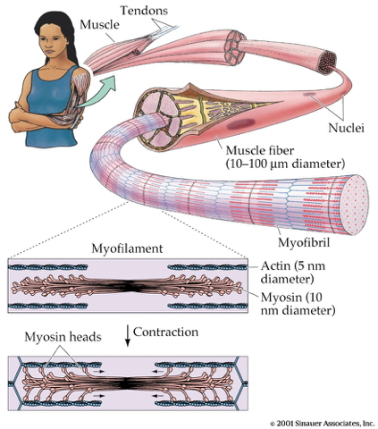
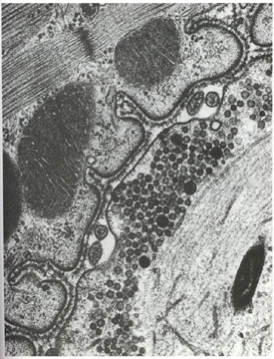

```{r setup, include=FALSE}
knitr::opts_chunk$set(echo = FALSE, warning = FALSE, 
                      message = FALSE,
                      fig.align = "center",
                      out.width = "600px")
```

# For fun

<iframe width="560" height="315" src="https://www.youtube.com/embed/Gs069dndIYk" title="YouTube video player" frameborder="0" allow="accelerometer; autoplay; clipboard-write; encrypted-media; gyroscope; picture-in-picture" allowfullscreen></iframe>

<!-- September Earth Wind & Fire -->


<iframe width="420" height="315" src="https://www.youtube.com/embed/XaI5IRuS2aE" frameborder="0" allowfullscreen></iframe>

<!-- This Land is Your Land, Guthrie -->

# Output types

- What types of outputs are there?
- How are they produced?
    + By the muscles
    + By the nervous system
- Outputs include
    + Movements, vocalizations, facial expressions, gestures
    + Autonomic responses
    + Endocrine responses
    
## Types of movements

```{r, fig.cap="https://medlineplus.gov/ency/images/ency/fullsize/17234.jpg"}
knitr::include_graphics("https://medlineplus.gov/ency/images/ency/fullsize/17234.jpg")
```

- Reflexes
    + Simple, highly stereotyped, unlearned, rapid, acquired early
- vs. planned or voluntary actions
    + Complex, flexible, acquired, slower
- Discrete (reaching) vs. rhythmic (walking)
- Ballistic (no feedback) vs. controlled (feedback)

# Motor system anatomy

## Key 'nodes'

```{r}
knitr::include_graphics("img/motor-controllers-biopsych.jpg")
```

- Primary motor cortex (M-I)
- Non-primary motor cortex
- Basal ganglia
- Brain stem
- Cerebellum
- Spinal cord

## Projection pathways

- Pyramidal tracts
    + Pyramidal cells (Cerebral Cortex Layer 5) in primary motor cortex (M1)
    + Corticobulbar (cortex -> brainstem) tract
    + Corticospinal (cortex -> spinal cord) tract
- Crossover (decussate) in medulla
    + L side of brain ennervates R side of body

```{r, fig.cap="https://commons.wikimedia.org/wiki/File:Gray764.png#/media/File:Gray764.png"}
knitr::include_graphics("img/gray-corticospinal-tract.png")
```

```{r, fig.cap="Source: Wikipedia"}
knitr::include_graphics("https://upload.wikimedia.org/wikipedia/commons/b/be/Gray672.png")
```

- Extrapyramidal system
    + Tectospinal tract
    + Vestibulospinal tract
    + Reticulospinal tract
- Involuntary movements
    + Posture, balance, arousal

# Muscles

- Generate forces
- In one direction

## Functional classes

- Axial
    + Trunk, neck, hips
- Proximal
    + Shoulder/elbow, pelvis/knee
- Distal
    + Hands/fingers, feet/toes
    
```{r, fig.cap="[[@Cantu2019-sz]](https://doi.org/10.3389/fneur.2019.00951)"}
knitr::include_graphics("https://www.frontiersin.org/files/Articles/476718/fneur-10-00951-HTML/image_m/fneur-10-00951-g001.jpg")
```

### Agonist/antagonist pairs

```{r}
knitr::include_graphics("http://2.bp.blogspot.com/-TpOC4my_NBc/T0J-MhEv29I/AAAAAAAAF88/dYLv7QzFwmg/s1600/Hamstring-Quad4.jpg")
```

## Anatomical types

```{r}
knitr::include_graphics("http://graphics8.nytimes.com/images/2007/08/01/health/adam/19917.jpg")
```

- Cardiac
- Striated (striped)
    + Skeletal
    + Voluntary control, mostly connected to tendons and bones
- Smooth
    + Arteries, hair follicles, uterus, intestines
    + Regulated by ANS (involuntary)

## How skeletal muscles contract

- Motoneuron (ventral horn of spinal cord)
- Projects to muscle fiber
- Neuromuscular junction
    + Synapse between motor neuron and muscle fiber
    + Releases ACh

```{r}
knitr::include_graphics("img/from-spinal-cord-to-muscle.jpg")
```

- Motor endplate
    + Contains nicotinic ACh receptors
- Activation produces excitatory endplate potential
    + Muscle fibers depolarize
    + Depolarization spreads along fibers like an action potential
    + Ca++ released from intramuscular stores

```{r}
knitr::include_graphics("http://www.siumed.edu/~dking2/ssb/images/NM040b.jpg")
```

- Muscle fibers contain bundles of myofibrils called sarcomeres
- Myofibrils
    + Contain actin & mysosin proteins
    + “Molecular gears”
- Bind, move, unbind in presence of Ca++,  adenosine triphosphate (ATP)

```{r}

```

```{r}

```

<iframe width="560" height="315" src="https://www.youtube.com/embed/cnAbzz3N0ak" frameborder="0" allow="accelerometer; autoplay; clipboard-write; encrypted-media; gyroscope; picture-in-picture" allowfullscreen></iframe>

### Skeletal muscle fiber types

```{r}
knitr::include_graphics("img/turkey.jpg")
```

- Fast twitch/fatiguing
    + Type II
    + White meat
- Slow twitch/fatiguing
    + Type I
    + Red meat
    
## Muscles as sensory organs

<!-- Server holding tray -->
```{r}
knitr::include_graphics("http://cdn.xl.thumbs.canstockphoto.com/canstock6466988.jpg")
```

### Two fiber types

<div class="centered">

</div>

- *Intrafusal* fibers
    + Sense muscle length and change in length, e.g. "stretch"
    + Also called muscle spindles
    + Provide muscle proprioception (perception about the self, a form of interoception)
    - Ennervated by by primary Ia afferents (sensory output from muscle); also secondary Type II fibers
    + Ennervated by gamma ($\gamma$) motor neurons (motor input)
- *Extrafusal* fibers
    + Generate force
    + ennervated by alpha ($\alpha$) motor neurons

### Monosynaptic stretch (myotatic) reflex

- Muscle stretched (length increases)
- Muscle spindle in intrafusal fiber activates
- Ia afferent sends signal to spinal cord
    + Activates alpha ($\alpha$) motor neuron
- Muscle contracts, shortens length

```{r, fig.cap="https://commons.wikimedia.org/wiki/File:Fusimotor_action.jpg#/media/File:Fusimotor_action.jpg"}
knitr::include_graphics("https://upload.wikimedia.org/wikipedia/commons/c/cd/Fusimotor_action.jpg")
```

- Gamma ($\gamma$) motor neuron fires to take up 'slack' in intrafusal fiber 

```{r}
knitr::include_graphics("img/intrafusal-extrafusal-fibers.jpg")
```

<!-- Belaying as metaphor -->
<div class="centered">

</div>

```{r}
knitr::include_graphics("img/stretch-reflex.jpg")
```

**Why doesn't antagonist muscle respond?**

- Polysynaptic inhibition of antagonist muscle
- Prevents/dampens tremor

**Speed of sensory information propagation**

- Brain gets fast(est) propagating sensory info from spindles

```{r}
knitr::include_graphics("img/axon-size-speed-tradeoff.jpg")
```

# Disorders of movement

- Parkinson's
- Huntington's

## The Faces of Parkinson's

<iframe width="560" height="315" src="https://www.youtube.com/embed/CqEwPqUO1Bw" frameborder="0" allowfullscreen></iframe>

- Slow, absent movement, resting tremor
- Cognitive deficits, depression
- DA Neurons in substantia nigra degenerate
- Treatments
    + DA agonists
    + DA agonists linked to impulse control disorders in ~1/7 patients [[@Ramirez-Zamora2016-rl]](http://doi.org/10.1586/14737175.2016.1158103)
    + Levodopa (L-Dopa), DA precursor

```{r}
knitr::include_graphics("https://upload.wikimedia.org/wikipedia/en/2/2b/Awakenings.jpg")
```

## Huntington's

<!-- Woody Guthrie -->
```{r}
knitr::include_graphics("http://cp91279.biography.com/1000509261001/1000509261001_1733824754001_woody-guthrie-centennial-1.jpg")
```

- Formerly Huntington’s Chorea
    + "Chorea" from Greek for "dance"
    + “Dance-like” pattern of involuntary movements
- Cognitive decline
- Genetic + environmental influences
- Disturbance in striatum
- No effective treatment
- But progress in an animal model targeting abnormal protein products [[@Li2019-to]](https://doi.org/10.1038/s41586-019-1722-1)

<iframe width="560" height="315" src="https://www.youtube.com/embed/HBLrY_nXU_U" frameborder="0" allowfullscreen></iframe>

### Clinical trial focused on gene therapy

```{r, fig.cap="https://clinicaltrials.gov/ct2/show/study/NCT03761849"}
knitr::include_graphics("img/huntingtons-trial.png")
```

# The big picture

- Control of movement determined by multiple sources
- Cerebral cortex + basal ganglia + cerebellum + spinal circuits

<div class="centered">

</div>

## The "real" reason for brains

<iframe src="https://embed-ssl.ted.com/talks/daniel_wolpert_the_real_reason_for_brains.html" width="640" height="360" frameborder="0" scrolling="no" webkitAllowFullScreen mozallowfullscreen allowFullScreen></iframe>

## What does motor cortex activity encode? 

<div class="centered">
Muscle activity? Limb velocity? Or...?


[Shenoy et al., 2013](http://dx.doi.org/10.1146/annurev-neuro-062111-150509)
</div>

<div class="centered">

</div>

## What does the cerebellum do?

- Predict future sensory states? [[@Ito2008-ai]](http://doi.org/10.1038/nrn2332)

<div class="centered">


## Systems perspective

- Cognitive/affective states
- Nervous system states
- Muscle states
- Actions
- Consequences of actions on world states
- Sensory states

```{r, fig.cap="[[@Powers1973-zn]](http://www.pctresources.com/Other/Reviews/BCP_book.pdf)"}
knitr::include_graphics("img/powers-5.2.png")
```

```{r, fig.cap="[[@Powers1973-zn]](http://www.pctresources.com/Other/Reviews/BCP_book.pdf)"}
knitr::include_graphics("img/powers-5.1.png")
```

```{r, fig.cap="[[@Powers1973-zn]](http://www.pctresources.com/Other/Reviews/BCP_book.pdf)"}
knitr::include_graphics("img/powers-6.1.png")
```

```{r, fig.cap="https://www.nytimes.com/2019/10/23/well/move/something-in-the-way-we-move.html"}

```

# References {.smaller}
