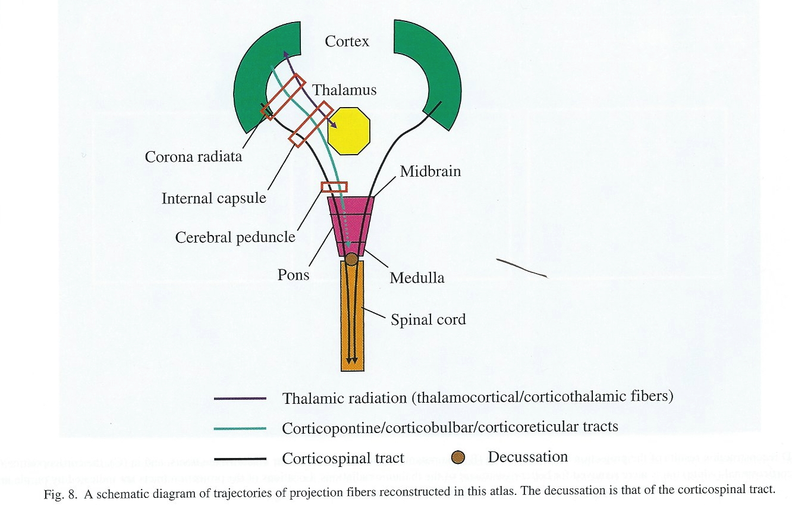

---

# Fun

<iframe width="560" height="315" src="https://www.youtube.com/embed/snO68aJTOpM" frameborder="0" allowfullscreen></iframe>

<!-- Pinky and the Brain video -->

<iframe width="560" height="315" src="https://www.youtube.com/embed/Qw8E9WnZTQk" frameborder="0" allow="accelerometer; autoplay; encrypted-media; gyroscope; picture-in-picture" allowfullscreen></iframe>
<!-- Kids brain song -->

# Resources

## Harvard Brain Atlas

<iframe src="http://www.med.harvard.edu/aanlib/cases/caseNA/pb9.htm" width="100%" height="400px"></iframe>

http://www.med.harvard.edu/aanlib/cases/caseNA/pb9.htm

## Brain anatomy through dance

<audio controls loop="loop">
  <source src="snd/brain_boxing.m4a" type="audio/mpeg">
  Your browser does not support the audio tag.
</audio>

# Directional terms

- Anterior/Posterior
- Medial/Lateral
- Superior/Inferior
- Dorsal/Ventral
- Rostral/Caudal

## Bipeds vs. quadripeds

https://upload.wikimedia.org/wikipedia/commons/thumb/0/00/1303_Human_Neuroaxis.jpg/800px-1303_Human_Neuroaxis.jpg

## Image axes

- Horizontal/Axial
- Coronal/Transverse/Frontal
- Sagittal (from the side)

# Supporting structures

## Meninges (outside -> in)

- Dura mater ('tough mother')
- Arachnoid membrane
- Subarachnoid space
- Pia mater ('gentle mother')
- Cerebrospinal fluid (CSF) between Arachnoid membrane and Pia Mater

## Ventricular system

- Also known as cerebral ventricles
- Lateral (1st & 2nd)
    - Forebrain/telencephalon
- 3rd
    - Diencephalon
- Cerebral aqueduct
    - Midbrain
- 4th
    - Hindbrain

- Ventricles filled with cerebrospinal fluid (CSF)
  - CSF clears metabolites during sleep [@xie2013sleep]?
  - Blockage of CSF flow -> hydrocephalus

## Blood Supply

- Carotid & basilar arteries converge on Circle of Willis
- Anterior, Middle, and Posterior Cerebral arteries main output

https://previews.123rf.com/images/hfsimaging/hfsimaging1208/hfsimaging120800005/14672522-drawing-of-the-blood-vessels-at-the-base-of-the-brain-called-the-circle-of-willis.jpg

https://teachmeanatomy.info/wp-content/uploads/Schematic-of-the-Circle-of-Willis.jpg

https://teachmeanatomy.info/wp-content/uploads/Regional-Blood-Supply-to-the-Cerebrum-1024x380.jpg

 By &lt;a href="//commons.wikimedia.org/wiki/User:BruceBlaus" title="User:BruceBlaus"&gt;BruceBlaus&lt;/a&gt; - &lt;span class="int-own-work" lang="en"&gt;Own work&lt;/span&gt;, <a href="https://creativecommons.org/licenses/by-sa/4.0" title="Creative Commons Attribution-Share Alike 4.0">CC BY-SA 4.0</a>, <a href="https://commons.wikimedia.org/w/index.php?curid=51638412">Link</a>

### Blood/brain barrier

- Cells forming blood vessel walls tightly packed
- Active transport of molecules typically required

[[@Abbott2006-jw]](http://dx.doi.org/10.1038/nrn1824)

---

[[@Abbott2006-jw]](http://dx.doi.org/10.1038/nrn1824)

#### Area Postrema

- In brainstem, blood-brain barrier thin
- Chemoreceptors (chemical receptors) detect toxins, trigger emesis if necessary

[[@Begg2013-fb]](http://dx.doi.org/10.1038/nrendo.2013.136)

# Organization of the Nervous System

https://www.pastmedicalhistory.co.uk/the-nervous-system-of-harriet-cole/

- Central Nervous System (CNS) 
  - Brain
  - Spinal Cord
  - (Everything encased in bone)
- Peripheral Nervous System (PNS)
  - Somatic division
  - Autonomic division
    - Sympathetic
    - Parasympathetic

# Organization of the CNS

| Major division | Ventricular Landmark | Embryonic Division | Structure       |
|----------------|----------------------|--------------------|-----------------|
| Forebrain      | Lateral              | Telencephalon      | Cerebral cortex |
|                |                      |                    | Basal ganglia   |
|                |                      |                    | Hippocampus, amygdala |
|                | Third                | Diencephalon       | Thalamus        |
|                |                      |                    | Hypothalamus    |
| Midbrain       | Cerebral Aqueduct    | Mesencephalon      | Tectum, tegmentum |
| Hindbrain      | 4th                  | Metencephalon      | Cerebellum, pons  |
|                | --                   | Mylencephalon      | Medulla oblongata |

- Forebrain, midbrain, hindbrain terminology derives from embryonic stages in CNS development.

https://upload.wikimedia.org/wikipedia/commons/c/c8/6_week_embryo_brain.jpg

## Hindbrain

https://upload.wikimedia.org/wikipedia/commons/thumb/5/54/EmbryonicBrain.svg/1200px-EmbryonicBrain.svg.png

- Hindbrain: structures adjacent (or caudal to) 4th ventricle
    - Medulla oblongata
    - Cerebellum
    - Pons

<iframe width="800" height="450" src="https://www.youtube.com/embed/Wq8EVQUc9a4" frameborder="0" allowfullscreen></iframe>

http://webspace.ship.edu/cgboer/medial-labelled.gif

### [Medulla oblongata](https://en.wikipedia.org/wiki/Medulla_oblongata) {.smaller}

- Cardiovascular regulation
- Muscle tone
- Fibers of passage
    - **A**scending fibers (from body), a.k.a. afferents
    - Descending fibers (**e**xiting brain), a.k.a., **e**fferents

https://upload.wikimedia.org/wikipedia/commons/6/69/1311_Brain_Stem.jpg

### Cerebellum

- “Little brain”
- Dorsal to pons
- Movement coordination, simple learning (classical conditioning)
- Largest number of neurons in the brain

<iframe width="800" height="450" src="https://www.youtube.com/embed/6szEeD0n-oU" frameborder="0" allowfullscreen></iframe>

### Pons

- Bulge on ventral brain stem
- Neuromodulatory nuclei
    - Nucleus (anatomically discrete cluster of neurons
    - Neuromodulators: neurotransmitters that modulate/alter function of other neurons
    - e.g., Serotonin (5-HT), norepinephrine (NE), acetylcholine (ACh), dopamine (DA)
- Relay to cerebellum

## Midbrain

- Tectum (roof), dorsal
- Tegmentum (floor), ventral

http://antranik.org/wp-content/uploads/2011/11/the-brain-stem-mid-brain-left-lateral-view-superior-colliculus-inferior-cerebellar-peduncle.jpg

### Tectum

- "Roof" of the midbrain
- Superior and inferior colliculus (colliculi is plural for 'little hill')
- Superior colliculus: Reflexive orienting of eyes, head, ears (superior colliculi)
    - Input from FEF, parietal lobe
    - Output to cranial nerve nuclei (III, IV, VI) in tegmentum, pons
- Inferior colliculus: Auditory processing (from brainstem to auditory thalamus)

### Tegmentum

- "Floor" of the midbrain
- Species-typical movement sequences
- Neuromodulatory nuclei
    + Norepinephrine (NE)
    + Serotonin (5-HT)
    + Dopamine (DA) -- from *ventral tegmental area (VTA)*

## Forebrain

- Diencephalon
- Telencephalon

### Diencephalon ('between brain')

- Thalamus
- Hypothalamus

#### Thalamus

- Input to cortex
- Functionally distinct *nuclei*
    - Lateral geniculate nucleus (LGN), vision
    - Medial geniculate nucleus (MGN), audition
    - Pulvinar, attention?
  

#### Hypothalamus

- Five Fs: fighting, fleeing/freezing, feeding, and reproduction
- Controls pituitary gland (“master” gland)
    + Anterior pituitary (indirect release of hormones)
        * e.g., Corticotropin Releasing Hormone (CRH) -> release of cortisol from Adrenal Cortex (adjacent to kidney)
    + Posterior pituitary (direct release of hormones)
        - Oxytocin
        - Vasopressin (aka, Arginine Vasopressin -- AVP; Anti-diuretic Hormone -- ADH)

<!-- Pituitary -->

### Telencephalon

- Basal ganglia
- Hippocampus, amygdala
- Cerebral cortex

#### Basal Ganglia

- Skill and habit learning
- Linked to Tourette syndrome, obsessive-compulsive disorder (OCD), addiction, movement disorders
- Example: Parkinson's Disease

- Striatum
	- Caudate nucleus 
	- Putamen
- Globus pallidus
- Subthalamic nucleus 
- Substantia nigra (tegmentum)

<!-- MRI of basal ganglia -->

<iframe width="560" height="315" src="https://www.youtube.com/embed/q7z-373pwuI" frameborder="0" allowfullscreen></iframe>

#### Hippocampus

- Hippocampus means "sea horse"

https://theconversation.com/explainer-what-happens-in-the-hippocampus-32589

- Medial to lateral ventricles
- Store memories of specific facts (semantic memory) or events (episodic memory)
- Place memory in non-human animals (& humans?)
- Fornix (axon fiber bundle) projects to (mammillary bodies of) hypothalamus

<iframe width="560" height="315" src="https://www.youtube.com/embed/wjvDDH-uJ0s" frameborder="0" allowfullscreen></iframe>

#### Amygdala (“almond”)

- Physiological state, behavioral readiness, affect
- NOT the fear center! [@ledoux_amygdala_2015].
- Projection to hypothalamus

<iframe width="560" height="315" src="https://www.youtube.com/embed/YB9rs4tEAaE" frameborder="0" allowfullscreen></iframe>

#### Cerebral Cortex 

- Cerebral hemispheres
- Groove (sulcus or sulci)
- Bumps (gyrus or gyri)
- Grey vs. white matter
- Lobes

**Lateral view**

**Medial view**

**Nissl stain**

##### Lobes of the cerebral cortex

- Frontal
- Temporal
- Parietal
- Occipital
- Names derive from underlying bones of the skull

**Longitudinal fissure**

- Also known as superior longitudinal fissure
- Divides the cerebral hemispheres

**Lateral sulcus/fissure**

- Also known as Sylvian Fissure
- Divides frontal from temporal lobe

**Central sulcus**

- Also known as Rolandic Fissure or Fissure of Rolando
- Divides frontal from parietal lobe

##### Frontal lobe

- Anterior to central sulcus
- Superior to lateral fissure
- Dorsal to temporal lobe

- Primary motor cortex (M-I or M1)
    - Precentral gyrus
    

https://en.wikipedia.org/wiki/Precentral_gyrus

    
- Secondary motor areas
    + Supplementary motor cortex (SMC)
    + Frontal eye fields (FEF)
- Prefrontal cortex
    + Planning, problem solving, working memory...?
    
- Secondary olfactory cortex

[[@Saive2014-uh]](http://doi.org/10.3389/fnbeh.2014.00240)

> Figure 1. Schematic view of the human olfactory system. The primary and secondary olfactory cortices are represented in blue and green, respectively. Amyg, amygdala; Ento, entorhinal cortex; Hipp, hippocampus; OFC, orbitofrontal cortex; PC, piriform cortex; Thal, thalamus (adapted from Royet et al., 2014).
>
> [[@Saive2014-uh]](http://doi.org/10.3389/fnbeh.2014.00240)

- Basal forebrain
    + [Nucleus accumbens (NAcc)](https://en.wikipedia.org/wiki/Nucleus_accumbens), part of ventral striatum

***Cingulate Gyrus***

- [Anterior cingulate cortex (ACC)](https://en.wikipedia.org/wiki/Anterior_cingulate_cortex)

**Inferior Frontal Gyrus (IFG)**

- Home to Broca's Area

**Middle Frontal Gyrus (MFG)**

- Home to Dorsolateral Prefrontal Cortex ([DLPFC](https://en.wikipedia.org/wiki/Dorsolateral_prefrontal_cortex))

**Superior Frontal Gyrus (SFG)**

- Brodmann Area 8
- Frontal Eye Fields (FEF)

https://en.wikipedia.org/wiki/Frontal_eye_fields

##### Temporal lobe 

- Ventral to frontal, parietal lobes
- Inferior to lateral fissure

- Primary auditory cortex (A-I or A1)

https://en.wikipedia.org/wiki/Auditory_cortex

**Superior Temporal Sulcus**

- Object, face recognition; biological motion processing
- Language processing

**Inferior Temporal Gyrus (ITG)**

- Continuation of ventral visual processing stream

https://en.wikipedia.org/wiki/Inferior_temporal_gyrus

**Entorhinal Cortex (ER)**

- Storage of memories about events, objects 
- Amygdala, hippocampus

##### Parietal lobe

- Caudal to frontal lobe
- Dorsal to temporal lobe
- Posterior to central sulcus

- Primary somatosensory cortex (S-I or S1)
  - information from sensors in skin, muscles, tendons, joints and viscera
- Post-central gyrus
    

https://en.wikipedia.org/wiki/Postcentral_gyrus

    
- Perception of spatial relations, action planning

**Inferior Parietal Lobule**

- e.g., language, mathematical operations, body image, etc.

**Superior Parietal Lobule**

- damage to can cause spatial hemi-neglect

https://en.wikipedia.org/wiki/Superior_parietal_lobule

##### Occipital lobe

- Caudal to parietal & temporal lobes

- Primary visual cortex (V1)
- Secondary visual areas (V2...V7)

##### Insular cortex (insula)

- medial to temporal lobe
- deep inside lateral fissure

- Primary gustatory cortex
- Self-awareness, interpersonal experiences, motor control, interoception

##### Brodmann Areas

- [Korbinian Brodmann](https://en.wikipedia.org/wiki/Korbinian_Brodmann)

- Cytoarchitectonic (cellular architecture) differences in cerebral cortex
- Numbered areas, e.g. V1 == Area 17

## White matter pathways

- Brainstem
- Projection fibers
- Association fibers
- Commissural fibers

[[@oishi2010mri]](https://books.google.com/books?hl=en&lr=&id=v8MWjTpVUAYC&oi=fnd&pg=PT1&dq=mri+atlas+of+human+white+matter&ots=mV146PeNPd&sig=2HjnDc0IxdCj-EVap1Gr77XIw7U#v=onepage&q=mri%20atlas%20of%20human%20white%20matter&f=false), Chapter 3, Figure 1.

### Brainstem projections

- Corticospinal tract (descending/efferent)
- Dorsal column/medial lemniscus (ascending/afferent)
- Superior/inferior cerebellar peduncles (from/to cerebellum)

[[@oishi2010mri]](https://books.google.com/books?hl=en&lr=&id=v8MWjTpVUAYC&oi=fnd&pg=PT1&dq=mri+atlas+of+human+white+matter&ots=mV146PeNPd&sig=2HjnDc0IxdCj-EVap1Gr77XIw7U#v=onepage&q=mri%20atlas%20of%20human%20white%20matter&f=false), Chapter 3, Figure 8.

### Projection fiber tracts

- Internal capsule
    - Thalamic radiation
    - Cortico-{pontine, bulbar, reticular} tracts

[[@oishi2010mri]](https://books.google.com/books?hl=en&lr=&id=v8MWjTpVUAYC&oi=fnd&pg=PT1&dq=mri+atlas+of+human+white+matter&ots=mV146PeNPd&sig=2HjnDc0IxdCj-EVap1Gr77XIw7U#v=onepage&q=mri%20atlas%20of%20human%20white%20matter&f=false), Chapter 3, Figure 11.

### Cortical white matter tracts

- Superior/inferior longitudinal fasciculus
    - [Arcuate fasciculus](https://en.wikipedia.org/wiki/Arcuate_fasciculus) part of sup. long. f.
- Superior/inferior fronto-occipital fasciculus
- Cingulum, fornix (hyp-hip), stria terminalis (hyp-amyg)

### Commissural fibers

- Corpus callosum
- Anterior commissure (AC)
- Posterior commissure (PC)

<!-- Corpus Callosum -->

**Anterior, Posterior Commissures**

## Spinal cord

- Spinal column w/ vertebrae
- Moving rostral -> caudal...
- Cervical (8), thoracic (12), lumbar (5), sacral (5), coccygeal (1)
- Spinal segments & 31 nerve pairs 
- Cauda equina

- Spinal segments (rostral to caudal) ennervate specific body segments
- When focusing on the skin, these are called *dermatomes*

- Dorsal/Ventral
    + Dorsal root (sensory)
    + Ventral root (mostly motor)
- Grey (interior) vs. white matter (exterior)
    + Cerebral cortex opposite (grey exterior, white interior)

<!-- Cross section of the spinal cord. -->

# Organization of the PNS 

- Somatic division
- Autonomic division (Autonomic Nervous System)

## Somatic division

### Cranial nerves

- Afferents (input), efferents (output), or mixed
- Innervate head and neck
- Olfactory (I), optic (II), (VIII) auditory,
vagus (X), etc. 
- Spinal nerves

### Spinal nerves

## Autonomic nervous system

- CNS & PNS components
- Controls “vegetative functions”
    + Limited voluntary control
- Two divisions
    + Sympathetic
    + Parasympathetic

- Bipolar (continuum) vs. bivariate autonomic space [[@Berntson1991-vq]](https://www.ncbi.nlm.nih.gov/pubmed/1660159)

### Sympathetic division

- Prepares body for action
- “Fight or flight”
- Spinal cord
    + ganglion chain along spinal column to End organs
- Neurotransmitters (NTs)
    + Preganglionic: ACh 
    + Post: NE
    
### Parasympathetic division

- “Around” sympathetic
- Restorative function
- “Rest & digest”
- Spinal cord (or Vagus n. from Xth cranial n.) -> ganglia near end organs -> end organ
    + NT: ACh
    
### Measures of ANS function

- Heart rate variability

https://upload.wikimedia.org/wikipedia/commons/thumb/4/4a/Neurovisceral_integration_model.png/330px-Neurovisceral_integration_model.png

- Galvanic skin response (GSR)
- [Pupillary response](https://en.wikipedia.org/wiki/Pupillary_response)

https://upload.wikimedia.org/wikipedia/commons/a/a5/Gray840.png

## References {.smaller}
