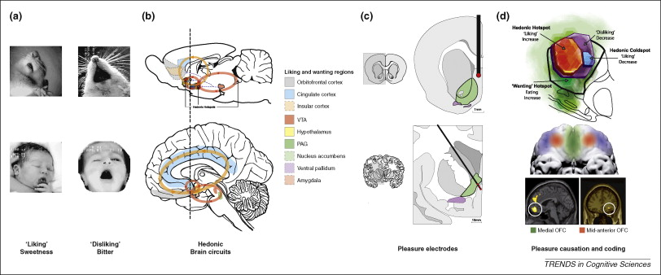

# Fun

<iframe width="420" height="315" src="https://www.youtube.com/embed/vJTxzsHsako" frameborder="0" allowfullscreen></iframe>

# The brain bases of emotion

[[@Lindquist2012-jr]](http://dx.doi.org/10.1017/S0140525X11000446)

## Locationist account

- *Where* in the brain is emotion processed?

[[@Lindquist2012-jr]](http://dx.doi.org/10.1017/S0140525X11000446)

> Figure 1. Locationist Hypotheses of Brain–Emotion Correspondence. A: Lateral view. B: Sagital view at the midline. C: Ventral view. D: Coronal view. Brain regions hypothesized to be associated with emotion categories are depicted. Here we depict the most popular locationist hypotheses, although other locationist hypotheses of brain–emotion correspondence exist (e.g., Panksepp, Reference Panksepp1998). Fear: amygdala (yellow); Disgust: insula (green); Anger: OFC (rust); Sadness: ACC (blue). A color version of this image can be viewed in the online version of this target article at http://www.journals.cambridge.org/bbs.
>
> [[@Lindquist2012-jr]](http://dx.doi.org/10.1017/S0140525X11000446)

## Constructionist account

> A psychological constructionist account of emotion assumes that emotions are psychological events that emerge out of more basic psychological operations that are not specific to emotion. In this view, mental categories such as anger, sadness, fear, et cetera, are not respected by the brain (nor are emotion, perception, or cognition, for that matter.

> ...emotions emerge when people make meaning out of sensory input from the body and from the world using knowledge of prior experiences. Emotions are “situated conceptualizations” (cf. Barsalou 2003) because the emerging meaning is tailored to the immediate environment and prepares the person to respond to sensory input in a way that is tailored to the situation

[[@Lindquist2012-jr]](http://dx.doi.org/10.1017/S0140525X11000446)

> Figure 4. The Neural Reference Space for Discrete Emotion. The neural reference space (phrase coined by Edelman [1989]) is the set of brain regions consistently activated across all studies assessing the experience or perception of anger, disgust, fear, happiness and sadness (i.e. the superordinate category emotion). Brain regions in yellow exceeded the height threshold ($p<.05$) and regions in orange exceeded the most stringent extent-based threshold ($p<.001$). Regions in pink and magenta correspond to lesser extent-based thresholds and are not discussed in this article. Cortex is grey, the brainstem and nucleus accumbens are green, the amygdala is blue and the cerebellum is purple. A color version of this image can be viewed in the online version of this target article at http://www.journals.cambridge.org/bbs.
>
> [[@Lindquist2012-jr]](http://dx.doi.org/10.1017/S0140525X11000446)

[[@Lindquist2012-jr]](http://dx.doi.org/10.1017/S0140525X11000446)

> Figure 5. Logistic Regression Findings. Selected results from the logistic regressions are presented (for additional findings, see Table S6 in supplementary materials). Circles with positive values represent a 100% increase in the odds that a variable predicted an increase in activity in that brain area. Circles with negative values represent a 100% increase in the odds that a variable predicted there would not be an increase in activity in that brain area. Legend: Blue lines: left hemisphere; Green lines: right hemisphere. Arrowheads: % change in odds is greater than values represented in this figure. Abbreviations: OFC: orbitofrontal cortex; DLPFC: dorsolateral prefrontal cortex; ATL: anterior temporal lobe; VLPFC: ventrolateral prefrontal cortex; DMPFC: dorsomedial prefrontal cortex; aMCC: anterior mid-cingulate cortex; sAAC: subgenual ACC. A color version of this image can be viewed in the online version of this target article at http://www.journals.cambridge.org/bbs.
>
> [[@Lindquist2012-jr]](http://dx.doi.org/10.1017/S0140525X11000446)

[[@Lindquist2012-jr]](http://dx.doi.org/10.1017/S0140525X11000446)

> Figure 6. Proportion of Study Contrasts with Increased Activation in Four Key Brain Areas. The y-axes plot the proportion of study contrasts in our database that had increased activation within 10mm of that brain area. The x-axes denote the contrast type separated by experience (exp) and perception (per). All brain regions depicted are in the right hemisphere. See Figures S2 and S3 in supplementary materials, available at http://www.journals.cambridge.org/bbs2012008, for additional regions. A color version of this image can be viewed in the online version of this target article at http://www.journals.cambridge.org/bbs.
>
> [[@Lindquist2012-jr]](http://dx.doi.org/10.1017/S0140525X11000446)

[[@Lindquist2012-jr]](http://dx.doi.org/10.1017/S0140525X11000446)

[[@Lindquist2012-jr]](http://dx.doi.org/10.1017/S0140525X11000446)

### Amygdala as a 'hub' for *fear*

> Our meta-analytic findings were inconsistent with a locationist hypothesis of amygdala function but were more consistent with the psychological constructionist hypothesis. Our density analyses revealed that, as compared to other brain regions, voxels within both amygdalae had more consistent increases in activation during instances of fear perception than during the perception of any other emotion category (Table 1). These voxels were not functionally specific for instances of perceiving fear, however. 

### Anterior insula as 'hub' for *disgust*

> Our meta-analytic findings were inconsistent with the locationist account that the anterior insula is the brain seat of disgust but were more consistent with the psychological constructionist account that insula activity is correlated with interoception and the awareness of affective feelings.

### Orbitofrontal cortex (OFC) as 'hub' for *anger*

> Our meta-analytic findings were inconsistent with the locationist hypothesis that the OFC is the brain seat of anger. As compared to voxels within other brain regions, voxels within the OFC did not have more consistent increases during instances of anger experience or perception than during any other emotion category. Rather, as compared to voxels within other brain regions, voxels within the left lOFC had more consistent increases in activation during instances of disgust experience than during the experience of other emotion categories.

### Anterior cingulate cortex as 'hub' for *sadness*

> Our meta-analytic evidence is inconsistent with the locationist account that the ACC is the brain basis of sadness, but more consistent with a psychological constructionist hypothesis of ACC function. As compared to voxels within other brain regions, voxels within the sACC, pACC and aMCC did not have more consistent increases when participants were experiencing or perceiving instances of sadness than during any other emotion category (Fig. 6).

# Fear

## Animal models

<small>
<http://www.cns.nyu.edu/labs/ledouxlab/images/image_research/fear_conditioning.jpg>
</small>

<iframe width="560" height="315" src="https://www.youtube.com/embed/ZlZekx1P1g4" title="YouTube video player" frameborder="0" allow="accelerometer; autoplay; clipboard-write; encrypted-media; gyroscope; picture-in-picture" allowfullscreen></iframe>

<https://youtu.be/ZlZekx1P1g4>

Adapted from [[@davis1992role]](http://dx.doi.org/10.1016/0165-6147(92)90014-W)

## Amygdala circuits

[[@medina2002parallels]](http://dx.doi.org/10.1038/nrn728)

- Direct (fast) pathways via thalamus
- Indirect (slower) pathways via cortex
- Input and output (behavior, physiology) specificity

## Specificity of learning stimulus/response mappings

[[@Pellman2016-xu]](https://doi.org/10.1016/j.tins.2016.04.001)

> Figure 1. Evolutionary Influences on Innate and Learned Fear. (A) Predatory history shapes prey's innate fear responses as illustrated by Peromyscus maniculatus austerus deer mouse's freezing to weasels and Peromyscus maniculatus gambeli deer mouse's jump (Jan Gillbank, ‘Drawing of a grey mouse’ October 27, 2012 via Wikimedia, Creative Commons Attribution 3.0 License) to gopher snakes [2]. P. m. austerus deer mice live in the coniferous forests of western Washington State and P. m. gambeli deer mice dwell in the arid grassland of eastern Washington State. (B) Ecological history predisposes fear learning. A classic study by John Garcia [3] found that rats easily acquired conditioned fear to bright/noisy conditioned stimulus (CS) paired to footshock unconditioned stimulus (US) and conditioned taste aversion to saccharin taste CS paired to X-rays (or LiCl) US. However, rats showed lack of conditioning to bright/noisy–X-ray (or LiCl) and saccharin–footshock pairings.
>
> [[@Pellman2016-xu]](https://doi.org/10.1016/j.tins.2016.04.001)

- Specific stimulus/response, $S \rightarrow R$, patterns
- Visual OR Auditory $\rightarrow$ pain
- Taste $\rightarrow$ nausea

[[@Pellman2016-xu]](https://doi.org/10.1016/j.tins.2016.04.001)

> Figure 4. Foraging and Risk of Predation. Foraging distance and time away from the safety of a nest are positively correlated with the risk of meeting predators, which can result in injury or death. Motivational factors, such as hunger, reproductive and parental state, and ecological factors, such as food availability and predator density, influence foraging behavior (represented by a horizontal arrow) and thus predation risk. Fear elicits immediate species-specific defense reactions upon meeting a predator and exerts enduring influences on foraging strategy.
>
> [[@Pellman2016-xu]](https://doi.org/10.1016/j.tins.2016.04.001)

## Circuitry

[[@Brandao2008-hw]](http://dx.doi.org/10.1016/j.bbr.2007.10.018)

[[@Pellman2016-xu]](https://doi.org/10.1016/j.tins.2016.04.001)

- BLA, basolateral complex of the amygdala
- CEA, central nucleus of the amygdala
- ITC, intercalated cells of the amygdala
- PL, prelimbic cortex
- IL, infralimbic cortex
- HPC, hippocampus
- Thal, thalamus
- PAG, periaqueductal gray
- PBN, parabrachial nucleus

# Stress types

- **Acute** stress
    + Short duration
- Brain detects threat
- Mobilizes physiological, behavioral responses
    + HPA (Cortisol), SAM (NE/Epi) axes
- vs. **Chronic** or stress
    + Long duration, persistent
    

[[@Kim2015-dd]](http://dx.doi.org/10.1101/lm.037291.114)

- Homeostasis vs. allostasis

[[@Lee2015-mh]](http://dx.doi.org/10.5483/bmbrep.2015.48.4.275)

## Glucocorticoids

- Released by
    - Adrenal cortex
    - Other areas in small amounts
+ Cortisol (hydrocortisone)
    * Increases blood glucose levels
    * Aids in fat, protein, carbohydrate metabolism
    * Suppresses immune system
    * Reduces inflammation
+ Receptors in body and brain
    

[[@Kadmiel2013-zz]](10.1016/j.tips.2013.07.003)

- Multiple feedback loops
- Diurnal pattern

http://www.molecularbrain.com/content/figures/1756-6606-3-2-1-l.jpg

## Impacts of chronic stress

- Major depressive disorder (MDD) & Post-traumatic Stress Disorder (PTSD)
  - Hippocampus and PFC volume reductions
  - Synapse loss 
  - Reduced dendritic density
  

[[@Schmaal2016-gb]](http://dx.doi.org/10.1038/mp.2015.69)

>*Cohen's d-effect sizes 95% CI and for differences in subcortical brain volumes between major depressive disorder (MDD) patients and healthy control subjects. Effect sizes were corrected for age, sex and intracranial volume (ICV). The effect size for ICV was corrected for age and sex. P<0.05 corrected. CI, confidence interval.*

[[@Schmaal2016-gb]](http://dx.doi.org/10.1038/mp.2015.69)

>*(a) Cohen's d-effect sizes 95% CI for differences in subcortical brain volumes between recurrent major depressive disorder (MDD) patients and healthy control subjects (striped pattern) and between first episode MDD patients and healthy controls (no pattern). (b) Cohen's d-effect sizes 95% CI for differences in subcortical brain volumes between early onset (⩽21) MDD patients and healthy control subjects (no pattern) and between later onset (>21) MDD patients and healthy controls (striped pattern). Effect sizes were corrected for age, sex and intracranial volume (ICV). P<0.05 corrected, P<0.05. CI, confidence interval.*

## Impacts of acute stress

[[@Musazzi2017-lr]](https://doi.org/10.1016/j.tins.2017.07.002)

>"*Figure 1. Neuroarchitectural Changes Induced by Repeated or Acute Stress in Rodents. (A) Repeated restraint stress (7 days) induces a reduction in the number and length of apical dendrites of pyramidal neurons (layer V) in the medial prefrontal cortex (PFC) of rats. (B) Magnified segment of dendrite from the same stressed rats, showing that repeated stress significantly decreases the number of spine synapses in medial PFC. (C) Reconstructions of representative infralimbic pyramidal neurons in mice exposed to zero (0), one (1×), or three (3×) unpredictable sessions of 10 min of forced swim stress. Apical dendritic branch length was significantly reduced after one or three stress episodes relative to controls. Adapted, with permission, from [24] (B) and [23] (C).*"

[[@Musazzi2017-lr]](https://doi.org/10.1016/j.tins.2017.07.002)

>*Figure 3. Graphic Summary of Short- and Long-Term Functional and Neuroarchitectural Effects in Prefrontal Cortex (PFC) Synapses after Acute Footshock (FS) Stress [44]. The fast and transient increase in corticosterone (CORT) release induced by acute (40 min) FS stress was accompanied by the rapid increase in both depolarization-evoked and hypertonic sucrose-evoked (readily releasable pool) glutamate release in PFC, and the number of small excitatory synapses. The enhancement of glutamate release was sustained for up to 24 h, as well as the increased number of excitatory synapses, which normalized between 24 h and 7 days after FS. Before 24 h had elapsed from the start of FS stress, retraction of apical dendrites began and was sustained for up to 14 days. The timing of actual FS stress (40 min) is indicated by the red marker. Number of excitatory synapses and apical dendrite length are indicative and not in scale with other readouts. CORT and glutamate release data adapted from [44].*

### Changes in neural architecture

- Hippocampus (rich in CORT receptors)
- Prefrontal cortex

### Neurochemical factors

- Cortisol enhances glutamate release
- Corticosteroid antagonists block this
- Ketamine (NMDA receptor antagonist) may act via similar mechanisms

Sapolsky, *Why Zebras Don't Get Ulcers*

# Pleasure/reward

## From conceptual category to brain circuitry

[[@kringelbach2009towards]](http://dx.doi.org/10.1016/j.tics.2009.08.006)

>*Figure 1. Measuring reward and hedonia. Reward and pleasure are multifaceted psychological concepts. Major processes within reward (first column) consist of motivation or wanting (white), learning (blue), and – most relevant to happiness – pleasure, liking or affect (light blue). Each of these contains explicit (top rows, light yellow) and implicit (bottom rows, yellow) psychological components (second column) that constantly interact and require careful scientific experimentation to tease apart. Explicit processes are consciously experienced (e.g. explicit pleasure and happiness, desire, or expectation), whereas implicit psychological processes are potentially unconscious in the sense that they can operate at a level not always directly accessible to conscious experience (implicit incentive salience, habits and ‘liking’ reactions), and must be further translated by other mechanisms into subjective feelings. Measurements or behavioral procedures that are especially sensitive markers of each of the processes are listed (third column). Examples of some of the brain regions and neurotransmitters are listed (fourth column), as well as specific examples of measurements (fifth column), such as an example of how highest subjective life satisfaction does not lead to the highest salaries (top) [93]. Another example shows the incentive-sensitization model of addiction and how ‘wanting’ to take drugs may grow over time independently of ‘liking’ and ‘learning’ drug pleasure as an individual becomes an addict (bottom) [94].*

## Neuroanatomy of 'pleasure'

[[@kringelbach2009towards]](http://dx.doi.org/10.1016/j.tics.2009.08.006)

>*Figure 2. Hedonic brain circuitry. The schematic figure shows the brain regions for causing and coding fundamental pleasure in rodents and humans. (a) Facial ‘liking’ and ‘disliking’ expressions elicited by sweet and bitter taste are similar in rodents and human infants. (b, d) Pleasure causation has been identified in rodents as arising from interlinked subcortical hedonic hotspots, such as in nucleus accumbens and ventral pallidum, where neural activation may increase ‘liking’ expressions to sweetness. Similar pleasure coding and incentive salience networks have also been identified in humans. (c) The so-called ‘pleasure’ electrodes in rodents and humans are unlikely to have elicited true pleasure but perhaps only incentive salience or ‘wanting’. (d) The cortical localization of pleasure coding might reach an apex in various regions of the orbitofrontal cortex, which differentiate subjective pleasantness from valence processing for aspects of the same stimulus, such as a pleasant food.*

- Analogous circuits mediating facial expressions of "liking" and "disliking"

## Reward

- A *reward* reinforces (makes more prevalent/probable) some behavior
- Milner and Olds [[@milner_discovery_1989]](http://doi.org/10.1016/S0149-7634(89)80013-2) discovered 'rewarding' power of electrical self-stimulation
- [[@heath1963electrical]](http://doi.org/10.1176/ajp.120.6.571) studied effects in human patients.

## Electrical self-stimulation

<iframe width="560" height="315" src="https://www.youtube.com/embed/de_b7k9kQp0" title="YouTube video player" frameborder="0" allow="accelerometer; autoplay; clipboard-write; encrypted-media; gyroscope; picture-in-picture" allowfullscreen></iframe>

<https://youtu.be/de_b7k9kQp0>

## "Reward" circuitry in the brain

[[@nestler2006mesolimbic]](http://dx.doi.org/10.1016/j.biopsych.2005.09.018)

- Lateral Hypothalamus (Hyp)
- Medial forebrain bundle (MFB)
- Ventral tegmental area (VTA) in midbrain
- Nucleus accumbens (nAcc)
- Dorsal Raphe Nucleus/Locus Coeruleus (DR/LC)
- Amygdala (Amy)
- Hippocampus (HP)
- Prefrontal cortex (PFC)

[[@kohls2012social]](http://dx.doi.org/10.1186/1866-1955-4-10)

## What does DA signal?

- Hedonia and anhedonia
- Incentive salience
- Reward prediction error (RPE)

[[@Hu2016-yw]](https://doi.org/10.1146/annurev-neuro-070815-014106)

DA and GABA signaling

[[@Watabe-Uchida2017-gi]](https://doi.org/10.1146/annurev-neuro-072116-031109)

> *Figure 1. Firing patterns of identified dopamine and GABA neurons in VTA. (a) VTA neurons were recorded while mice performed an odor-outcome association task in which different odors predicted different outcomes (see legend on right). Odors were presented for 1 s (gray shading), and outcomes were presented after a 1-s delay. Neuron types were identified based on their optogenetic responses. Dopamine neurons (left) showed phasic excitations to reward-predictive cues and reward. GABA neurons (right) showed sustained activation during the delay. Data from Cohen et al. (2012). (b) Reward expectation modulates dopamine neuron firing. The plot on the left shows when outcome was presented, and the right-hand plot shows when outcome was omitted. Different odors predicted reward with different probabilities. Higher reward probability increased cue responses but suppressed reward responses. Data from Tian & Uchida (2015). Also see Fiorillo et al. (2003) and Matsumoto & Hikosaka (2009a,b). (c) Reward context-dependent modulation of dopamine responses to air puff–predictive cues and air puff. The task conditions during recording differed only in the probability of reward. Dopamine neurons showed both excitation and inhibition in high-reward contexts (left) but only inhibition in low-reward contexts (right). The response in reward trials is not shown. Data from Matsumoto et al. (2016). Abbreviations: CS, conditioned stimulus; VTA, ventral tegmental area.*

Expectation modulates DA signaling

[[@Watabe-Uchida2017-gi]](https://doi.org/10.1146/annurev-neuro-072116-031109)

> *Figure 2. Subtractive computation in dopamine neurons. (a) In one task condition (no odor, black), different amounts of reward were presented without any predictive cue. In another condition (odor A, orange), the timing of reward was predicted by an odor. (b) Prediction. Division should change the slope of the curve, whereas subtraction should cause a downward shift. (c) Average response of 40 optogenetically identified dopamine neurons. Prediction caused a subtractive shift. Data from Eshel et al. (2015). (d) Three example neurons. Although individual neurons exhibited diversity with respect to response magnitudes, their response functions were scaled versions of one another. Data from Eshel et al. (2016).*

DA network

[[@Watabe-Uchida2017-gi]](https://doi.org/10.1146/annurev-neuro-072116-031109)

[[@Watabe-Uchida2017-gi]](https://doi.org/10.1146/annurev-neuro-072116-031109)

Reward & Aversion Networks

[[@Watabe-Uchida2017-gi]](https://doi.org/10.1146/annurev-neuro-072116-031109)

## Psychopharmacology of pleasure

- Dopamine
- Serotonin, Norepinephrine
- ACh

[[@cock_sleep_2008]](http://dx.doi.org/10.1038/ncpneuro0775)

- Opioids, endogenous morphine-like NTs (endorphins)

[[@clapp-niaa]](http://pubs.niaaa.nih.gov/publications/arh314/310-339.htm)

- Cannabinoids = psychoactive compounds found in cannibis
- Endocannabinoids (endogenous cannabinoid system)
    - Cannabinoid CB1 receptors in CNS; CB2 in body, immune system

[[@flores_cannabinoid-hypocretin_2013]](http://dx.doi.org/10.3389/fnins.2013.00256)

# References
