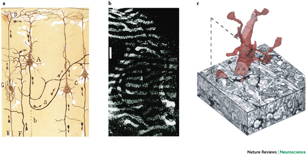
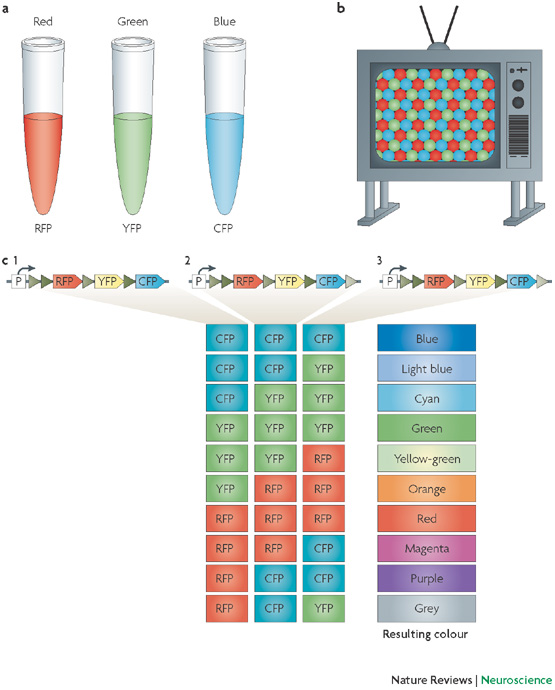
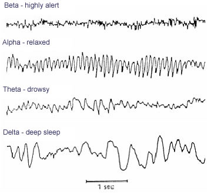
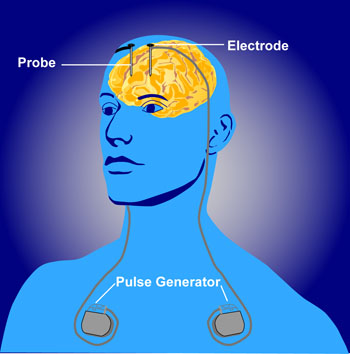

# Neuroscience methods

## Evaluating methods 

### What are we measuring?

- Structure
- Activity
    - Why not *function*?

### What is the question?

- Structure X -> Structure Y
- Structure X -> Function Y

## Evaluating methods

### Strengths & Weaknesses

- Cost
- Invasiveness
- Spatial/temporal resolution

## Spatial resolution {.flexbox .vcenter}

http://ai.ato.ms/MITECS/Images/churchland.figure1.gif

## ...and temporal resolution {.flexbox .vcenter}

<small>
[[@Sejnowski2014-aa]](http://doi.org/10.1038/nn.3839)
</small>

## Types of methods

- Structural
  - Anatomy
  - Connectivity/connectome
- Functional
  - What does it do?
  - Physiology/Activity

# Structural methods

## Mapping microstructure

- Cell/axon stains
- Cellular distribution, concentration, microanatomy

### Golgi stain 

- whole cells, but small %

<http://connectomethebook.com/wp-content/uploads/2011/11/Brainforest17_1119.jpg>

---

http://wam.umn.edu/wp-content/uploads/2016/12/WAM_Cajal_m1673.jpg

#### [Camillo Golgi](https://en.wikipedia.org/wiki/Camillo_Golgi)

### Nissl stain

- Only cell bodies
- Cell density ~ color intensity

#### [Franz Nissl](https://en.wikipedia.org/wiki/Franz_Nissl)

https://en.wikipedia.org/wiki/Franz_Nissl

### [Brainbow](http://cbs.fas.harvard.edu/science/connectome-project/brainbow)

[[@lichtman_technicolour_2008]](http://doi.org/10.1038/nrn2391)

[[@lichtman_technicolour_2008]](http://doi.org/10.1038/nrn2391)

### [Clarity](http://clarityresourcecenter.com/CLARITY.html)

<iframe width="560" height="315" src="https://www.youtube.com/embed/c-NMfp13Uug" frameborder="0" allowfullscreen></iframe>

<https://www.youtube.com/embed/c-NMfp13Uug>

### [CUBIC](https://en.wikipedia.org/wiki/CUBIC)

- CUBIC (“clear, unobstructed brain/body imaging cocktails and computational analysis")
- [[@Susaki2014-xj]](http://dx.doi.org/10.1016/j.cell.2014.03.042)

### Example

[[@Ando2018-ze]](https://doi.org/10.1016/B978-0-444-63639-3.00021-9)

> Fig. 21.2. Immunostaining of CUBIC-clarified 500-μm-thick slices from human Alzheimer disease postmortem brain frontal cortex. Human Alzheimer disease frontal cortex tissue immunostained for Aß (6E10, red) and for tau (B19, green). Stack depth of 264 μm; step size = 1 μm. Stack photos were taken with a two-photon microscope equipped with a 20 × air objective. Scale bar, 100 μm.

### Evaluating micro/cellular techniques

- Invasive (in humans post-mortem only)
- High *spatial* resolution, but poor/coarse *temporal*

### Example

"SHANK2 mutations associated with autism spectrum disorder cause hyperconnectivity of human neurons" [[@Zaslavsky2019-ln]](http://dx.doi.org/10.1038/s41593-019-0365-8)

[[@Zaslavsky2019-ln]](http://dx.doi.org/10.1038/s41593-019-0365-8)

> a, iPSCs generated from multiple control and affected individuals are differentiated into NPCs. NPCs are differentiated in separate wells for 4 weeks and then differentially fluorescently labeled control (CTRL) and mutant (MUT) cells are sparsely seeded onto a large unlabeled neuronal population (the lawn) and cocultured with astrocytes. b, Timeline of the experiment, starting with seeding of NPCs. Measurements of mutant cells are normalized to control cells in the same well. c, Sparse seeding allows simultaneous analyses of cell morphology and connectivity (total number of SYN1 puncta) of single neurons. Scale bars, 100 μm. d, To compare cell morphology, paired representative traces are shown of control and SHANK2 ASD or engineered SHANK2 KO neurons grown in the same well. e, To compare synaptic function, sEPSCs are recorded from neurons grown in the same well. Confocal images and traces shown in c and d are representative of iPSC-derived neurons imaged in experiments depicted in Fig. 2a–c. sEPSC traces shown in e are representative of patch-clamp recordings of iPSC-derived neurons described in Fig. 3.

## Mapping macro-structures

### Computed axial tomography (CAT), CT

- X-ray based

<http://img.tfd.com/mk/T/X2604-T-22.png>

#### Tomography {.flexbox .vcenter}

<http://static.howstuffworks.com/gif/cat-scan-pineapple.jpg>

---

<!-- https://medium.com/datadriveninvestor/detecting-brain-hemorrhage-in-computed-tomography-ct-imaging-d1276cb6bdb7 -->

<small>
<https://medium.com/datadriveninvestor/detecting-brain-hemorrhage-in-computed-tomography-ct-imaging-d1276cb6bdb7>
</small>

### Magnetic Resonance Imaging (MRI)

#### What it measures/how it works

- Magnetic resonance a property of some isotopes and complex molecules
- Hydrogen ($H$), common in water & fat, is one
- In magnetic field, $H$ atoms absorb and release radio frequency (RF) energy
- $H$ atoms align with strong magnetic field

---

- Applying RF pulse perturbs alignment
- Rate/timing of realignment varies by tissue
- Realignment gives off radio frequency (RF) signals
- Strength of RF ~ density of $H$ (or other target)
- K-space (frequency/phase) -> anatomical space

---

<http://s.hswstatic.com/gif/mri-steps.jpg>

#### Structural MRI

- Tissue density/type differences
- **Gray matter** (nerve cells & **dendrites**) vs. **white matter** (**axon fibers**)

#### Example

[[@Lee2021-ae]](http://dx.doi.org/10.1016/j.biopsych.2020.10.014)

> *Figure 1*. Longitudinal trajectories of total cerebral volume, gray matter volume, and white matter volume from early to middle childhood (A) in boys with autism spectrum disorder (ASD) and typically developing (TD) boys and (B) in boys with ASD and disproportionate megalencephaly (ASD-DM), boys with ASD with normative cerebral volume-to-height ratio (ASD-N), and TD boys.

#### MR Spectroscopy (specific metabolites)

- Region sizes/volumes

#### Voxel-based morphometry (VBM)

- MRI technique for measuring brain sizes/volumes

[[@Pomarol-Clotet2010-tq]](https://dx.doi.org/10.1038/mp.2009.146)

> Top panel: (a) voxel-based morphometry (VBM) findings. Regions showing significant volume reduction thresholded at P=0.01 in the schizophrenic patients are shown in orange. Bottom panel: (b) functional magnetic resonance imaging (fMRI) findings. Regions are shown where there were significant differences between patients and controls during performance of the n-back task (2-back vs baseline comparison), thresholded at P=0.01. Blue indicates hypoactivation, that is, areas where controls activated significantly more than the patients. Orange indicates areas where the schizophrenic patients showed failure to deactivate in comparison to controls. The right side of the images represents the left side of the brain.

- Volume differences in schizophrenics vs. controls
- Colored portions are statistical maps placed on top of a base structural map.
- Maps (a) provide information about the comparison in brain volumes between patients and controls in those areas, and in (b) functional imaging differences in an n-back task.

## Mapping the wiring diagram ("connectome")

---

### Retrograde (output -> input) vs. anterograde (input -> output) tracers

<http://openi.nlm.nih.gov/imgs/512/348/3176268/3176268_1471-2105-12-351-2.png>

---

<iframe width="560" height="315" src="https://www.youtube.com/embed/nvXuq9jRWKE" frameborder="0" allowfullscreen></iframe>

<https://www.youtube.com/embed/nvXuq9jRWKE>

### Diffusion Tensor Imaging (DTI)

- Structural MRI technique
- Diffusion tensor: measurement of spatial pattern of $H_2O$ diffusion in small volume
- Uniform ("isotropic") vs. non-uniform ("anisotropic")
- Strong anisotropy suggests large # of axons with similar orientations (fiber tracts)

---

---

https://www.nap.edu/openbook/13373/xhtml/images/p26.jpg

### Visualizing the connectome

[[@Bonilha2015-qx]](http://dx.doi.org/10.1371/journal.pone.0135247)

> Fig 2. Link-wise ICCs. Each matrix entry represents the ICC observed for the white matter link between the gray matter ROI in the row and the gray matter ROI in the column. https://doi.org/10.1371/journal.pone.0135247.g002
>
> [[@Bonilha2015-qx]](http://dx.doi.org/10.1371/journal.pone.0135247)

http://www.humanconnectome.org

# Functional methods

- Recording from the brain 
- Interfering with the brain 
- Stimulating the brain
- Simulating the brain

## Recording from the brain

### Single/multi-unit Recording {.flexbox .vcenter}

- Microelectrodes + amplification
- Small numbers of nerve cells

https://www.nature.com/nrn/journal/v5/n11/images/nrn1535-i1.jpg

- What does neuron X respond to?
- How does firing frequency, timing vary with behavior?
- Great temporal (ms), spatial resolution (um)
- Invasive
- Rarely suitable for humans, but...

### [Electrocorticography (ECoG)](https://en.wikipedia.org/wiki/Electrocorticography)

>Grid electrodes: (A) Craniotomy performed for electrocorticography (ECoG) grid electrode placement in epilepsy surgery candidate at Comprehensive Epilepsy Program, Florida Hospital for Children, Orlando, Florida, United States. (B) ECoG electrode grids placed directly on the brain surface. They will be used during presurgical monitoring for localizing seizure onset zone. The same electrodes are stimulated during electrical cortical stimulation mapping for identification of eloquent cortex. The ECoG signal recorded from these grids is separated in a different stream and used for real-time functional mapping (RTFM). (C) 3D reconstruction of the brain with overlaid grid electrodes. This reconstruction is used for creating RTFM montage.

---- 

<iframe width="560" height="315" src="https://www.youtube.com/embed/u50HPRe3rOY" title="YouTube video player" frameborder="0" allow="accelerometer; autoplay; clipboard-write; encrypted-media; gyroscope; picture-in-picture" allowfullscreen></iframe>

<https://www.youtube.com/watch?v=u50HPRe3rOY>

### [Positron Emission Tomography (PET)](https://en.wikipedia.org/wiki/Positron_emission_tomography)

<iframe width="560" height="315" src="https://www.youtube.com/embed/GHLBcCv4rqk" frameborder="0" allowfullscreen></iframe>

- Radioactive tracers (glucose, oxygen)
- Positron decay activates paired detectors
- Tomographic techniques reconstruct 3D geometry
- Experimental condition - control
- Average across individuals
- Temporal (~ s) and spatial (mm-cm) resolution worse than fMRI
- Radioactive exposures + mildly invasive 
- Dose < airline crew exposure in 1 yr

[[@Rischka2018-pk](http://dx.doi.org/10.1016/j.neuroimage.2018.06.079)]

> Fig. 2. Task-specific changes during finger tapping and visual stimulation obtained with fPET and fMRI across all subjects. Good agreement between CMRGlu and BOLD was observed for primary motor and visual cortices. However, in secondary areas (e.g., supplementary motor area, cerebellum, secondary visual areas) significant changes were only detected with fMRI but not with fPET (Table 2). Statistical maps were corrected for multiple comparisons at p<0.05 FWE corrected voxel-level.

> The brain's energy budget can be non-invasively assessed with different imaging modalities such as functional MRI (fMRI) and PET (fPET), which are sensitive to oxygen and glucose demands, respectively. The introduction of hybrid PET/MRI systems further enables the simultaneous acquisition of these parameters...The absence of a correlation and the different activation pattern between fPET and fMRI suggest that glucose metabolism and oxygen demand capture complementary aspects of energy demands.
>
> [[@Rischka2018-pk](http://dx.doi.org/10.1016/j.neuroimage.2018.06.079)]

## Functional Magnetic Resonance Imaging (fMRI)

- Neural activity -> local $O_2$ consumption increase
- *Blood Oxygen Level Dependent (BOLD)* response
- Oxygenated vs. deoxygenated hemoglobin ≠ magnetic susceptibility
- How do regional blood $O_2$ levels (& flow & volume) vary with behavior X?
- MRI "signals" relate to the speed (1/T) of "relaxation" of the perturbed nuclei to their state of alignment with the main ($B_0$) magnetic field.
- Imaging protocols emphasize different time constants of this relaxation ($T1$, $T2$, $T2^*$); $T^2*$ for BOLD imaging

### Evaluating fMRI

- Non-invasive, but expensive
- Moderate but improving (mm) spatial, temporal (~sec) resolution
- Spatial limits due to 
    - field strength (@ 3T $~3mm^3$ voxel)
    - Physiology of hemodynamic response
- Temporal limits due to
    - Hemodynamic Response Function (HRF): ~ 1s delay plus 3-6 s ramp-up
    - Speed of image acquisition
- *Indirect* measure of neural activity

### Hemodynamic Response Function (HRF) {.smaller}

https://openi.nlm.nih.gov/imgs/512/236/3109590/3109590_TONIJ-5-24_F1.png

---

Generate "predicted" BOLD response to event; compare to actual

### Higher field strengths (3 Tesla vs. 7 Tesla)

[[@Sladky2013-bu]](https://dx.doi.org/10.1016/j.ejrad.2011.09.025)

### but fMRI underpowered

[[@Szucs2017-fc]]((https://doi.org/10.1371/journal.pbio.2000797))

> Assuming a realistic range of prior probabilities for null hypotheses, false report probability is likely to exceed 50% for the whole literature.
>
> [[@Szucs2017-fc]]((https://doi.org/10.1371/journal.pbio.2000797))

---

- Solutions
    - Make data, materials (analysis code) more widely and openly available
    - [OpenNeuro.org](https://openneuro.org), [Human Connectome Project](https://www.humanconnectomeproject.org/), [Databrary.org](https://databrary.org), etc.
    - Reuse shared data (e.g., [Adolescent Brain & Cognitive Development (ABCD) Study](https://abcdstudy.org/))
    - Increase sample sizes, improve detection of small effects

### Functional Near-infrared Spectroscopy (fNIRS)

- Near infrared light penetrates scalp and skull, refracted by brain tissue
- Returned signal altered by blood $O_2$ levels
- Time course (temporal resolution) ~ BOLD fMRI
- Spatial resolution low
- More suitable for pediatric populations (less susceptible to movement artefact)

---

Source: https://cibsr.stanford.edu/NIRS_Lab.html

---

Source: https://nirx.net

### Electroencephalography (EEG)

- How does it work?
- Electrodes on scalp or brain surface

#### What does EEG measure?

- Voltage *differences* between source and reference electrode
- Combined activity of huge # of neurons
- Current/voltage gradients between *apical* (near surface) dendrites and *basal* (deeper) dendrites and cell body/soma

https://neurofeedbackalliance.org/wp-content/uploads/2016/10/Dipole.jpg"

#### Collecting EEG {.flexbox .vcenter .smaller}

https://sfari.org/images/images-2013-folder/images-sfn-2013/20131110sfneeg

#### Evaluating EEG

- High temporal, poor spatial resolution
- Analyze activity in different 'bands' of frequencies
    + LOW: deep sleep (delta or $\delta$ band)
    + MIDDLE: Quiet, alert state (alpha $\alpha$ band)
    + HIGHER: Sensorimotor activity reflecting observed actions? (mu or $\mu$ band), [[@Hobson2017-oj]](https://dx.doi.org/10.1098/rsos.160662)
    + HIGHER STILL: “Binding” information across senses or plasticity? (gamma or $\gamma$ band), [[@Amo2017-tz]](https://dx.doi.org/10.1371/journal.pone.0186008)
  
---

https://www.peakmind.co.uk/images/frequency.jpg

#### [Event-related potentials (ERPs)](https://en.wikipedia.org/wiki/Event-related_potential)

- EEGs time-locked to some event 
- ...Averaged over many such events (trials)

<!-- <a href="https://2.bp.blogspot.com/_2ob-1_LsjJs/TAUjw9i_dYI/AAAAAAAAAQQ/9AfiHsnD-P8/s1600/ERP_technique.gif"> -->
<!--  -->
<!-- </a> -->

#### [Brain Computer Interface (BCI)](https://computer.howstuffworks.com/brain-computer-interface.htm) {.smaller}

- Based on EEG/ERPs

### Magneto-encephalography (MEG)

- Like EEG, but measuring magnetic fields
- Electrical and magnetic fields orthogonal
- High temporal resolution
- Magnetic fields propagate w/o distortion
    - But are orthogonal to electric field
- Requires shielded chamber (to keep out strong magnetic fields)
- ++ cost vs. EEG

https://upload.wikimedia.org/wikipedia/commons/e/e6/NIMH_MEG.jpg

New device minimizes problems with motion

[[@Hill2019-ik]](https://doi.org/10.1038/s41467-019-12486-x)

>Figure 1. A paediatric MEG system: a Experimental setup for three participants age 2- (left), 5- (centre) and 24-years (right). OPMs, housed in a modified bike helmet, measured the MEG signal. b Time-frequency spectra from a single (synthesised gradiometer) channel. Changes in neural oscillations are shown; blue indicates a reduction in oscillatory amplitude relative to baseline; yellow indicates an increase. Note reduction in beta (13–30 Hz) and mu (8–13 Hz) amplitude. c The spatial signature of beta modulation during the period of tactile stimulation (0 s < t < 2 s) (blue overlay)

### How do EEG/MEG and fMRI relate? {.flexbox .vcenter}

<!--  -->

[[@Logothetis2001-ul]](https://doi.org/10.1038/35084005)

- BOLD fMRI likely reflects **presynaptic** *input* to area
- EEG/MEG likely reflects **postsynaptic** *response* to those inputs
- [[@Logothetis2001-ul]](https://doi.org/10.1038/35084005) and [[@Logothetis2004-mn]](https://doi.org/10.1146/annurev.physiol.66.082602.092845)

## Manipulating the brain

- Interfering with it 
- Stimulating it

### Interfering with the brain

- Nature’s“experiments” 
- Stroke, head injury, tumor
- Neuropsychology

#### Phineas Gage {.flexbox .vcenter .smaller}

http://www.doctorsimpossible.com/the-curious-case-of-phineas-gage/

---

#### Evaluating neuropsychological methods

- Logic: IF damage to area X impairs performance, THEN region critical for behavior Y
- *Double dissociation*: Damage to area Z leaves behavior Y intact 
- Weak spatial/temporal resolution

## Stimulating the brain

- Electrical (**Direct Current Stimulation - DCS**)
- Pharmacological
- Magnetic (**Transcranial magnetic stimulation - TMS**)
- Spatial/temporal resolution?
- Assume stimulation mimics natural activity?

#### Deep brain stimulation as therapy

- Depression 
- Epilepsy
- Parkinson’s Disease 

https://www.nimh.nih.gov/images/health-and-outreach/mental-health-topic-brain-stimulation-therapies/dbs_60715_3.jpg

---

<iframe width="560" height="315" src="https://www.youtube.com/embed/KDjWdtDyz5I" frameborder="0" allow="autoplay; encrypted-media" allowfullscreen></iframe>

<https://youtu.be/KDjWdtDyz5I>

### [Optogenetics](https://en.wikipedia.org/wiki/Optogenetics)

<iframe width="560" height="315" src="https://www.youtube.com/embed/I64X7vHSHOE" frameborder="0" allowfullscreen></iframe>

<https://www.youtube.com/embed/I64X7vHSHOE>

- Gene splicing techniques insert light-sensitive molecules into neuronal membranes
- Application of light at specific wavelengths alters neuronal function
- Cell-type specific and temporally precise control
- Mimics brain activity

<iframe width="560" height="315" src="https://www.youtube.com/embed/FlGbznBmx8M" frameborder="0" allow="autoplay; encrypted-media" allowfullscreen></iframe>

<https://www.youtube.com/embed/FlGbznBmx8M>

<https://youtu.be/FlGbznBmx8M>

## *Sim*ulating the brain

- Computer/mathematical models of brain function
- Example: neural networks
- Cheap, noninvasive, can be stimulated or “lesioned”

### Blue Brain project

[[@Markram2006-vu]](http://dx.doi.org/10.1038/nrn1848)

---

<iframe width="560" height="315" src="https://www.youtube.com/embed/gn4nRCC9TwQ" frameborder="0" allowfullscreen></iframe>

<https://www.youtube.com/embed/gn4nRCC9TwQ>

## References
