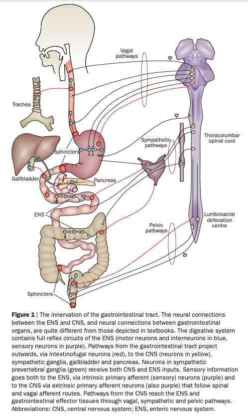

# Enteric nervous system

## Anatomy

```{r, fig.cap="[[@Furness2012-dy]](http://dx.doi.org/10.1038/nrgastro.2012.32)"}

```

## Gut/brain connection

```{r, fig.cap="[[@Sarkar2016-qf]](https://doi.org/10.1016/j.tins.2016.09.002)"}
knitr::include_graphics("https://ars.els-cdn.com/content/image/1-s2.0-S0166223616301138-gr1.jpg")
```

## Role of glial cells

```{r, fig.cap="[[@Ahmadzai2021-ur]](http://dx.doi.org/10.1073/pnas.2025938118)"}
knitr::include_graphics("https://www.pnas.org/content/pnas/118/40/e2025938118/F1.large.jpg")
```