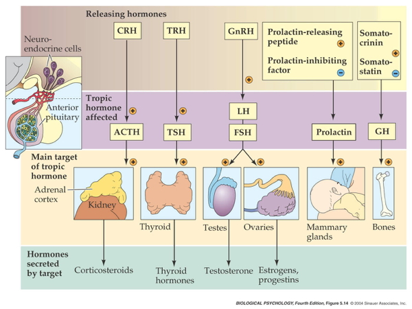

# Neural communication

## What triggers the action potential?

- Soma receives input from dendrites (and on soma directly)
- Axon hillock sums/integrates

Source: https://commons.wikimedia.org/wiki/File%3A1224_Post_Synaptic_Potential_Summation.jpg

- If sum > threshold, action potential "fires"
- Action potential propagates along the axon
- Action potential's rapid change in voltage triggers neurotransmitter (NT) release

## Synaptic transmission

*Synapse* permits neuron to pass electrical or chemical messages to another neuron or target cell (muscle, gland, etc.)

### Synapse Types & Locations

- Chemical
- Electrical
  - Gap junctions
  - *Cytosol* (and ionic current) flows through adjacent neurons 

 By Mariana Ruiz &lt;a href="//commons.wikimedia.org/wiki/User:LadyofHats" title="User:LadyofHats"&gt;LadyofHats&lt;/a&gt; - the diagram i made myself using the information on this websites as source: &lt;a rel="nofollow" class="external autonumber" href="http://academic.brooklyn.cuny.edu/biology/bio4fv/page/gap-junctions.html"&gt;[1]&lt;/a&gt;, &lt;a rel="nofollow" class="external autonumber" href="http://www-biology.ucsd.edu/classes/bipn140.FA05/10_2.jpg"&gt;[2]&lt;/a&gt;, &lt;a rel="nofollow" class="external autonumber" href="http://www.colorado.edu/MCDB/MCDB1150/ohd/gapjunctionmodel.JPG"&gt;[3]&lt;/a&gt;, and&lt;a rel="nofollow" class="external autonumber" href="http://www.lrz-muenchen.de/~jmd/gap%20junction2.gif"&gt;[4]&lt;/a&gt;. Made with Adobe Illustrator. Image renamed from &lt;a href="//commons.wikimedia.org/w/index.php?title=File:Gap_cell_junction.svg&amp;amp;action=edit&amp;amp;redlink=1" class="new" title="File:Gap cell junction.svg (page does not exist)"&gt;File:Gap cell junction.svg&lt;/a&gt;, Public Domain, <a href="https://commons.wikimedia.org/w/index.php?curid=6027074">Link</a>

### Steps in chemical transmission

- *Voltage-gated calcium Ca++ channels* open
- $Ca^{++}$ influx causes *synaptic vesicles* to bind with presynaptic membrane, fuse with membrane, spill contents via *exocytosis*

[[@Haucke2011-ub]](http://dx.doi.org/10.1038/nrn2948)

[[@Hastoy2017-it]](https://doi.org/10.1016/j.ceca.2017.10.005)

[[@Hastoy2017-it]](https://doi.org/10.1016/j.ceca.2017.10.005)

- NTs diffuse across *synaptic cleft*
- NTs bind with *receptors* on *postsynaptic membrane*
  - Cause some post-synaptic effect
- NTs unbind from receptor
- NTs inactivated
- NTs diffuse along concentration gradient

Source: https://commons.wikimedia.org/wiki/File%3ASynapseSchematic_en.svg

**Relative sizes**

- Neural membrane ~8 nm
- Synaptic vesicles ~40-60 or ~90-120 nm
- Synaptic cleft ~20-50 nm
- Cleft small relative to vesicles

### Receptor/channel types

#### Leak/passive

- Vary in selectivity, permeability

#### Transporters/exchangers

+ Ionic
    * $Na^+$/$K^+$ ATP-ase/pump
+ Chemical
    * e.g., Dopamine transporter (DAT)

#### Ionotropic receptors (receptor + ion channel)

- Ligand-gated
- Open/close channel
- Ions flow in/out depending on membrane voltage and ion type
- Fast-responding (< 2 ms), but short-duration effects (< 100 ms)

#### Metabotropic receptors (receptor only)

- G-proteins ->
- Trigger 2nd messengers
- Open/close adjacent channels, change metabolism

### Receptors generate *postsynaptic potentials (PSPs)*

- Small voltage changes
- Amplitude scales with # of receptors activated
- *Excitatory PSPs (EPSPs)*
    + Depolarize neuron (make more +)
- *Inhibitory (IPSPs)*
    + Hyperpolarize neuron (make more -)

### NTs inactivated

- Buffering
    + e.g., glutamate into astrocytes [@GLIA:GLIA10]
- *Reuptake* via *[transporters](https://en.wikipedia.org/wiki/Neurotransmitter_transporter)*
    + e.g., serotonin via serotonin transporter (SERT)
- Enzymatic degradation
    + e.g., acetylcholine esterase (AChE) degrades acetylcholine (ACh)

### Questions to ponder

- Why do NTs diffuse from pre- to post-synaptic membrane?
- Why must NTs be inactivated?
- What sort of PSP would *opening* a $Na^+$ channel produce?
- What sort of PSP would *opening* a $Cl^-$ channel produce?
- What sort of PSP would *closing* a $K^+$ produce?

### Synapse location and function

Source: Blausen.com staff https://commons.wikimedia.org/wiki/File%3ABlausen_0843_SynapseTypes.png

- on dendrites
    + usually excitatory 
- on cell bodies
    + usually inhibitory 
- on axons 
    + usually modulatory (change p(fire))

## Neurotransmitters

### What are they?

- Chemicals produced by neurons
- Released by neurons
- Bound by neurons and other cells
- Send messages (have physiological effect on target cells)
- Inactivated after release

### Things to know

- Neurotransmitter
- Where released from/to
- What receptor(s) bind it

### Amino acids

| Family      | Neurotansmitter                     |
|-------------|-------------------------------------|
| Amino acids | [Glutamate](https://en.wikipedia.org/wiki/Glutamate_(neurotransmitter))                           |
|             | [$\gamma$ aminobutyric acid (GABA)](https://en.wikipedia.org/wiki/Gamma-Aminobutyric_acid)      |
|             | Glycine                             |
|             | Aspartate                           |

#### Glutamate

- Widespread in CNS (~ 1/2 all synapses)
- Primary excitatory NT in CNS
- Role in learning (via NMDA receptor)
- Receptors on neurons and glia (astrocytes and oligodendrocytes)
- Linked to umami (savory) taste sensation (think monosodium glutamate or MSG)
- Dysregulation in schizophrenia [[@McCutcheon2020-ez]](https://doi.org/10.1002/wps.20693), mood disorders [[@Malgorzata2020-nz]](http://dx.doi.org/10.1080/14728222.2020.1836160)

| Type         | Receptor   | Esp Permeable to |
|--------------|------------|------------------|
| Ionotropic   | AMPA       | $Na^+$, $K^+$          |
|              | Kainate    |                  |
|              | NMDA       | $Ca^{++}$              |
| Metabotropic | mGlu       |                  |

#### $\gamma$ aminobutyric acid (GABA)

- Primary inhibitory NT in CNS
- Excitatory in developing CNS, [$Cl^-$] in >> [$Cl^-$] out
- Binding sites for benzodiazepines (BZD; e.g., Valium), barbiturates, ethanol, etc.
    - BZD affect subset of GABA-A receptors
    - Increase total Cl- influx

| Type         | Receptor   | Esp Permeable to |
|--------------|------------|------------------|
| Ionotropic   | GABA-A     | $Cl^-$              |
| Metabotropic | GABA-B     | $K^+$                 |

Source: https://commons.wikimedia.org/wiki/File:GABAA-receptor-protein-example.png#/media/File:GABAA-receptor-protein-example.pn

#### Other amino acid NTs

- *Aspartate*
    + Like Glu, stimulates NMDA receptor
- *Glycine*
    + Spinal cord interneurons

### Acetylcholine (ACh)

- Primary excitatory NT of CNS output
- Somatic nervous system (motor neuron -> neuromuscular junction)
- Autonomic nervous system (ANS)
    + Sympathetic branch: preganglionic neuron
    + Parasympathetic branch: pre/postganglionic
    

Source: http://myzone.hrvfitltd.netdna-cdn.com/wp-content/uploads/2014/09/Image-1.jpg

| Type         | Receptor           | Esp Permeable to | Blocked by       |
|--------------|--------------------|------------------|------------------|
| Ionotropic   | Nicotinic (nAChR)  | $Na^+$, $K^+$          | e.g., Curare     |
| Metabotropic | Muscarinic (mAChR) | $K^+$               | e.g., Atropine   |

#### Curare

#### Atropine

- aka, nightshade or belladonna
- inhibits (acts as an antagonist for) muscarinic ACh receptor

https://cdn.britannica.com/92/183192-050-1741C2F9/Belladonna-nightshade-leaves-berries-alkaloids-humans.jpg

https://commons.wikimedia.org/wiki/File:Eye_treated_with_dilating_eye_drops.jpg

### Monoamine NTs

| Family      | Neurotransmitter                        | Comment |
|-------------|-----------------------------------------|---------|
| Monoamines  | Dopamine (DA)                           | Catecholamine |
|             | Norepinephrine (NE)/Noradrenaline (NAd) | Catecholamine |
|             | Epinephrine (Epi)/Adrenaline (Ad)       | Catecholamine |
|             | Serotonin (5-HT)                        | Indolamine |
|             | Melatonin                               | Indolamine |
|             | Histamine                               | |

- Synthesis pathway: DA -> NE/NAd -> Epi/Ad

### Information processing

- Point-to-point
    + One sender, small number of recipients
    + Glu, GABA
- Broadcast
    + One sender, widespread recipients
    + DA, NE, 5-HT, melatonin, histamine
- Need to know
    + NT, where projecting, type of receptor to predict function

#### Dopamine

- Released by
    + Substantia nigra -> striatum, *meso-striatal projection*
    + Ventral tegmental area (VTA) -> nucleus accumbens, ventral striatum, hippocampus, amygdala, cortex; *meso-limbo-cortical projection*

http://thebrain.mcgill.ca/flash/a/a_03/a_03_cl/a_03_cl_que/a_03_cl_que_1a.gif

##### Clinical relevance

- Parkinson's Disease (mesostriatal)
    + DA agonists treat (agonists facilitate/increase transmission)
- ADHD (mesolimbocortical)
- Schizophrenia (mesolimbocortical)
    + DA antagonists treat
- Addiction (mesolimbocortical)

##### Inactivated via

- Chemical breakdown (e.g., via monoamine oxidase), <http://www.scholarpedia.org/article/Dopamine_anatomy#Dopamine_receptors>
- Dopamine transporter (DAT)
  - Psychostimulants (e.g., cocaine, methylphenidate) act upon. [[@noauthor_undated-on]](https://www.sciencedirect.com/topics/neuroscience/dopamine-transporter)
  - DAT also transports norepinephrine (NE)

https://ars.els-cdn.com/content/image/3-s2.0-B9780123741059002379-gr1.jpg?_

| Type         | Receptor             | Comments                      |
|--------------|----------------------|-------------------------------|
| Metabotropic | D1-like (D1 and D5)  | more prevalent                |
|              | D2-like (D2, D3, D4) | target of many antipsychotics |

#### Norepinephrine

- Released by
    + *[locus coeruleus](http://www.scholarpedia.org/article/Locus_coeruleus)* in pons/caudal tegmentum
    + postganglionic sympathetic neurons onto target tissues
    
    

    
    
https://upload.wikimedia.org/wikipedia/commons/thumb/c/cd/Locus_coeruleus_highlighted.jpg/300px-Locus_coeruleus_highlighted.jpg

    

https://www.researchgate.net/publication/338194613/figure/fig1/AS:842586742857728@1577899742543/Locus-coeruleus-LC-efferent-pathways-and-relevant-functions-LC-projects-throughout-the.png

Source: http://myzone.hrvfitltd.netdna-cdn.com/wp-content/uploads/2014/09/Image-1.jpg

    
- Role in arousal, mood, eating, sexual behavior

##### Clinical relevance 

- ADHD, Alzheimer's Disease, Parkinson's Disease, depression

##### Inactivated by 

- Norepinephrine transporter (NET), aka noradrenaline transporter (NAT)
    - Contributes to DA uptake, too.
- Also monoamine oxidase inhibitors (MAOIs)
    + inactivate monoamines in neurons, astrocytes
    + MAOIs increase NE, DA
    + Treatment for depression

[[@Youdim2006-wk]](http://dx.doi.org/10.1038/nrn1883)

<!-- MAOIs figure -->

| Type         | Receptor             | Comments                           |
|--------------|----------------------|------------------------------------|
| Metabotropic | $\alpha$ (1,2)         | antagonists treat anxiety, panic   |
|              | $\beta$ (1,2,3)        | 'beta blockers' in cardiac disease |

#### Adrenaline/Epinephrine

- Synthesized from norepinephrine
- Both NT and hormone
    - As NT: Released in small amounts by medulla oblongata
    - As hormone: Released by adrenal medulla
- Binds to ($\alpha_{1,2}$, $\beta_{1,2,3}$ receptors in blood vessels, cardiac muscle, lungs, eye muscles controlling pupil dilation, liver, pancreas, etc.
- Release enhanced by cortisol from adrenal cortex
- Unusual in NOT being part of negative feedback system controlling its own release

#### Serotonin (5-HT)

- Released by *raphe nuclei* in brainstem
- Role in mood, sleep, eating, pain, nausea, cognition, memory
- Modulates release of other NTs
- Most (90%; [[@De_Ponti2004-lo]](http://dx.doi.org/10.1136/gut.2003.035568)) of body's 5-HT regulates digestion

- Separate cortical, subcortical 5-HT projection pathways?

[[@Ren2018-zl]](http://dx.doi.org/10.1016/j.cell.2018.07.043)

- Seven receptor families (5-HT 1-7) with 14 types
- All but one metabotropic

##### Clinical relevance

- Ecstasy (MDMA) disturbs serotonin
- So does LSD
- Fluoxetine (Prozac)
    + *Selective Serotonin Reuptake Inhibitor (SSRI)*
    + Treats depression, panic, eating disorders, others
- 5-HT3 receptor antagonists are anti-mimetics used in treating nausea

 Public Domain, <a href="https://commons.wikimedia.org/w/index.php?curid=45159949">Link</a>

- Different psychological roles (passive vs. active coping) associated with different 5-HT receptor subtypes? [[@Carhart-Harris2017-aq]](http://dx.doi.org/10.1177/0269881117725915)

#### Melatonin

- Released by pineal gland (pine cone-like appearance)

http://www.vivo.colostate.edu/hbooks/pathphys/endocrine/otherendo/pinealgland.jpg

#### Histamine

- Released by hypothalamus, projects to whole brain
- $H_1$-$H_4$ Metabotropic receptors, one ionotropic type in thalamus/hypothalamus
- Role in arousal/sleep regulation
- In body, part of immune/inflammatory response

### Targets of psychotropic drugs

Source: https://stahlonline.cambridge.org/essential_4th_chapter.jsf?page=chapter2_summary.htm&name=Chapter%202&title=Summary

### Other NTs

- Gases
    + *Nitric Oxide (NO)*, *carbon monoxide (CO)*
- Neuropeptides
    + *Substance P* and *endorphins* (endogenous morphine-like compounds) have role in pain
    + *Orexin/hypocretin*, project from lateral hypothalamus across brain, regulates appetite, arousal
    + *Cholecystokinin (CCK)* stimulates digestion
- Purines
    + *Adenosine* (inhibited by caffeine)
- Others
    + *Anandamide* (activates endogenous cannabinoid receptors)

# Hormonal communication

- Chemicals secreted into blood
- Act on specific target tissues via receptors
- Produce specific effects

## Examples of substances that are both hormones and NTs
    
- Melatonin
- Epinephrine/adrenaline
- Oxytocin
- Arginine Vasopressin (AVP) or Anti-Diuretic Hormone (ADH)
    
## Behaviors under hormonal influence

### Ingestive (eating/ drinking)

+ Fluid levels
+ Na, K, Ca levels 
+ Digestion
+ Blood glucose levels

### Reproduction-related

+ Sexual Maturation
+ Mating
+ Birth
+ Care giving

### To threat/challenge

+ Metabolism
+ Heart rate, blood pressure 
+ Digestion
+ Arousal

### Common factors

- Biological imperatives
- Proscribed in space and time
- Foraging/hunting
    + Find targets distributed in space, evaluate, act upon
- Often involve others

## Principles of hormonal action

- Gradual action
- Change intensity or probability of behavior 
- Behavior influences/influenced by hormones
    + +/- Feedback
- Multiple effects on different tissues
- Produced in small amounts; released in bursts 
- Levels vary daily, seasonally
    + or are triggered by specific external/internal events
- Effect cellular metabolism 
- Influence only cells with receptors
- Point to point vs.“broadcast”
    + Wider broadcast than neuromodulators

### Similarities between neural and hormonal communication

- Chemical messengers stored for later release 
- Release follows stimulation
- Action depends on specific receptors
- 2nd messenger systems common

### Hormonal release sites

- CNS
    + Hypothalamus
    + *Pituitary*
        * *Anterior*
        * *Posterior*
    + Pineal gland
- Rest of body
    + *Thyroid*
    +  *Adrenal (ad=adjacent, renal=kidney) gland*
        * *Adrenal cortex*
        * *Adrenal medulla*
    + *Gonads* (testes/ovaries)

## Two release systems from hypothalamus 

### Direct release

- Hypothalamus (paraventricular, supraoptic nucleus) to
- Posterior pituitary
    + *Oxytocin*
    + *Arginine Vasopressin (AVP, vasopressin)*
        

Source: https://upload.wikimedia.org/wikipedia/commons/thumb/7/70/1807_The_Posterior_Pituitary_Complex.jpg/594px-1807_The_Posterior_Pituitary_Complex.jpg

### Indirect release

- Hypothalamus -> *releasing hormones* 
- Anterior pituitary -> *tropic hormones*
- End organs

## Case studies

### Responses to threat or challenge

[[@ulrich-lai_neural_2009]](http://doi.org/10.1038/nrn2647)

> Figure 1: General scheme of brain acute-stress regulatory pathways. Stressors activate brainstem and/or forebrain limbic structures. The brainstem can generate rapid hypothalamic-pituitary-adrenal (HPA) axis and autonomic nervous system (ANS) responses through direct projections to hypophysiotrophic neurons in the paraventricular nucleus of the hypothalamus (PVN) or to preganglionic autonomic neurons (stress response triggers). By contrast, forebrain limbic regions have no direct connections with the HPA axis or the ANS and thus require intervening synapses before they can access autonomic or neuroendocrine neurons (top-down regulation). A high proportion of these intervening neurons are located in hypothalamic nuclei that are also responsive to homeostatic status, providing a mechanism by which the descending limbic information can be modulated according to the physiological status of the animal ('middle management'). BST, bed nucleus of the stria terminalis; CVO, circumventricular organ; SAM, sympathoadrenomedullary system.
>
> [[@ulrich-lai_neural_2009]](http://doi.org/10.1038/nrn2647)

- Neural response
    + *Sympathetic Adrenal Medulla (SAM) response*
    + Sympathetic NS activation of adrenal medulla, other organs
    + Releases NE and Epi into bloodstream
  

[[@ulrich-lai_neural_2009]](http://doi.org/10.1038/nrn2647)

> Figure 2: The brain circuitry that regulates autonomic stress responses. Stress-induced pre-autonomic outflow originates in multiple brain areas. The colours denote brain regions that are implicated in sympathetic activation (blue), parasympathetic activation (red) or both (bicoloured). The paraventricular nucleus of the hypothalamus (PVN) has substantial projections to both sympathetic and parasympathetic nuclei, including the nucleus of the solitary tract (NTS), the dorsal motor nucleus of the vagus nerve (DMX), the intermediolateral cell column (IML), the locus coeruleus (LC) and the ventrolateral medulla (VLM) (the latter two sets of projections are not shown for clarity). The rostral VLM, LC and PVN directly innervate the IML and are thought to initiate sympathetic responses. The NTS in turn receives direct input from neurons in the infralimbic cortex (IL), the central amygdala (CeA) and the PVN. Other hypothalamic regions, most notably the dorsomedial hypothalamus (DMH), modulate autonomic nervous system activation through connections with the PVN (and possibly other descending pathways) (see main text). Parasympathetic outflow is mediated largely by descending outputs from the DMX and the nucleus ambiguus (NA) and is under the direct influence of the prelimbic cortex (PL), the PVN and possibly other descending relays (see main text). Parasympathetic effects of the anterior bed nucleus of the stria terminalis (aBST) are probably mediated by relays in the PVN or the NTS. The anatomical complexity of autonomic nervous system integration is underscored by the mixing of sympathetic and parasympathetic projection neurons in individual nuclei.
>
> [[@ulrich-lai_neural_2009]](http://doi.org/10.1038/nrn2647)

- Endocrine response
    + *Hypothalamic Pituitary Adrenal (HPA) axis*
    + Adrenal hormones released
- Hypothalamus
    + *Corticotropin Releasing Hormone (CRH)*
- Anterior pituitary
    + *Adrenocorticotropic hormone (ACTH)*
- Adrenal cortex
    + *Glucocorticoids (e.g., cortisol)*
    + *Mineralocorticoids (e.g. aldosterone)*
    

[[@ulrich-lai_neural_2009]](http://doi.org/10.1038/nrn2647)

> Figure 3: The brain circuitry that regulates HPA axis stress responses. Stress-induced activation of the dorsal part of the medial parvocellular paraventricular nucleus of the hypothalamus (PVNmpd) originates in several brain regions (excitatory inputs are coloured blue with solid lines and inhibitory (GABA (γ-aminobutyric acid)-ergic) inputs are coloured red with dashed lines). The paraventricular nucleus of the hypothalamus (PVN) receives direct noradrenergic, adrenergic and peptidergic innervation from the nucleus of the solitary tract (NTS). The dorsomedial components of the dorsomedial hypothalamus (dmDMH) and the arcuate nucleus (Arc) provide intrahypothalamic stress excitation. The anterior part of the bed nucleus of the stria terminalis (BST), particularly the anteroventral nucleus of the BST (avBST), activates hypothalamic-pituitary-adrenocortical (HPA) axis stress responses. The PVN also receives a stress-excitatory drive from the dorsal raphe, the tuberomammillary nucleus, the supramammillary nucleus and the spinal cord, among others (omitted in the interest of space). Activation of the PVNmpd is inhibited by numerous hypothalamic circuits, including the medial preoptic area (mPOA), the ventrolateral component of the dorsomedial hypothalamus (vlDMH) and local neurons in the peri-PVN region (pPVN), encompassing the PVN surround and the subparaventricular zone. The posterior subregions of the bed nucleus of the stria terminalis (pBST) provide a prominent forebrain inhibition of HPA axis responses; most of these inputs are GABAergic. Brain sections are modified, with permission, from Ref. 154 © (1998) Academic Press.
>
> [[@ulrich-lai_neural_2009]](http://doi.org/10.1038/nrn2647)

#### Adrenal hormones

- *Steroids*
    + Derived from cholesterol
- *Cortisol*
    + increases blood glucose, anti-inflammatory effects
    + negative consequences of prolonged exposure 
- *Aldosterone*
    + Regulates Na (and water)
    
### Reproductive behavior -- the milk letdown reflex

- Supraoptic & Paraventricular nucleus (PVN) of hypothalamus releases oxytocin 
    - Into bloodstream via posterior pituitary (endocrine)
    - Onto neurons in nucleus accumbens (neurocrine), amygdala, brainstem
- Oxytocin stimulates milk ducts to secrete

https://64.media.tumblr.com/29ad3be13cc42500c5c0eb496b465745/tumblr_nr55r27dOB1tqg84mo1_640.png

**Oxytocin's role...**

- Sexual arousal
- Released in bursts during orgasm
- Stimulates uterine, vaginal contraction during labor
    - But mouse OXY knock-out model still engages in reproductive behavior and gives birth without incident.
- Oxytocin cells in ovarian corpus luteum, testicles, retina, adrenal medulla, pancreas
- Links to social interaction, bonding  [[@Weisman2013158]](http://dx.doi.org/10.1016/j.biopsych.2013.05.026)
- Alters face processing in autism  [[@Domes2013164]](http://dx.doi.org/10.1016/j.biopsych.2013.02.007)
- May inhibit fear/anxiety-related behaviors by gating amygdala [[@viviani2011oxytocin]](http://doi.org/10.1126/science.1201043)

### Circadian rhythms

#### Melatonin

- Diurnal rhythm
- Night time peak, early morning low
- Secretion suppressed by short wavelength or "blue" light (< 460-480 nm)
- Rhythm irregular until ~3 mos post-natal [[@Ardura2003-tw]](http://dx.doi.org/68571)
- Peak weakens, broadens with age

- Pathway
    - Suprachiasmatic nucleus (SCN) of the hypothalamus
    - Paraventricular nucleus of the hypothalamus
    - Spinal cord
    - Superior cervical ganglion
    - Pineal gland

<iframe width="560" height="315" src="https://www.youtube.com/embed/fgJPnQCJ9eE" title="YouTube video player" frameborder="0" allow="accelerometer; autoplay; clipboard-write; encrypted-media; gyroscope; picture-in-picture" allowfullscreen></iframe>

## Thinking about neurochemical influences

- Measure hormones in blood, saliva; can't effectively measure NTs
- Multivariate, nonlinear, mutually interacting
- Varied time scales
    - Phasic (e.g., cortisol in response to challenge)
    - Periodic (e.g., melatonin; diurnal cortisol)
- Peripheral effects + neural feedback
- State variables and behavior
    - Are your participants sleepy, hungry, horny, distressed...
    - Endogenous & exogenous influences
    - Systems interact; need better, broader, and denser measurement

# Enteric nervous system

## Anatomy

- A component of the Autonomic Nervous System (ANS), along with the Sympathetic (SNS) and Parasympathetic Nervous Systems (PNS).
- number of neurons comparable to entire spinal cord (Alloway & Pritchard)

[[@Furness2012-dy]](http://dx.doi.org/10.1038/nrgastro.2012.32)

## Gut/brain connection

[[@Sarkar2016-qf]](https://doi.org/10.1016/j.tins.2016.09.002)

> Figure 1. Systems-Level Overview of Psychobiotic Action. Blue arrows indicate psychobiotic processes and effects, while red arrows indicate processes associated with leaky gut and inflammation. Probiotics directly introduce beneficial bacteria such as Lactobacilli and Bifidobacteria into the gut. Prebiotics (e.g., galacto-oligosaccharides) support the growth of such bacteria. SCFAs and gut hormones: Both probiotics and prebiotics increase production of short-chain fatty acids (SCFAs), which interact with gut mucosal enteroendocrine cells and catalyse the release of gut hormones such as cholecystokinin (CCK), peptide tyrosine tyrosine (PYY) and glucagon-like peptide- 1 (GLP-1). Prebiotics may have stronger effects in this regard in comparison to probiotics. SCFAs and gut hormones enter circulation and can migrate into the central nervous system. Gut hormones are also secreted by tissues other than enteroendocrine cells. Neurotransmitters: psychobiotics enhance neurotransmitter production in the gut, including dopamine (DA), serotonin (5-HT), noradrenaline (NA), and γ-aminobutyric acid (GABA), which likely modulate neurotransmission in the proximal synapses of the enteric nervous system. Vagal connections: the vagus nerve synapses on enteric neurons and enables gut–brain communication. Stress, barrier function, and cytokines: barrier dysfunction is exacerbated through stress-induced glucocorticoid exposure. This enables migration of bacteria with pro-inflammatory components, increasing inflammation directly and also triggering a rise in pro-inflammatory cytokines via the immunogenic response. These cytokines impair the integrity of the blood–brain barrier and permit access to potentially pathogenic or inflammatory elements. Pro-inflammatory cytokines (red circles) also reduce the integrity of the gut barrier. Psychobiotic action restores gut barrier function and decreases circulating concentrations of glucocorticoids and pro-inflammatory cytokines. They also increase concentrations of anti-inflammatory cytokines (blue circles), which enhance integrity of the blood–brain barrier, the gut barrier, and reduce overall inflammation. Cytokines clustering at the brain represent cytokine interaction with the blood–brain barrier. Central lymphatic vessels: cytokines may interact more directly with the brain than previously appreciated through the recently discovered central lymphatic vessels.
>
> [[@Sarkar2016-qf]](https://doi.org/10.1016/j.tins.2016.09.002)

- "Moody microbes or fecal phrenology"? [[@Forsythe2016-ur]](http://dx.doi.org/10.1186/s12916-016-0604-8).
- 2015 systematic review (with only $n=10$ trials) shows "very limited evidence for the efficacy of probiotic interventions in psychological outcomes." [[@Romijn2015-bu]](http://dx.doi.org/10.1093/nutrit/nuv025).
- ROG: But do we have good data about what people actually consume?

## Physiology

- electrogastrogram (EGG) from ENS [[@Al_Taee2020-no]](http://dx.doi.org/10.1007/978-3-030-14347-3_50) measures gastric motility

> Fig. 1. Gastric pacesetter potentials or slow waves originate from the pacemaker area on the greater curve. Pacesetter potentials travel in a circumferential and aboral direction at a rate of approximately 3 cycles per minute (cpm). The cutaneously recorded electrogastrogram shows 3-cpm wave pattern. The fundus has no rhythmic electrical activity.
>
>  [[@Al_Taee2020-no]](http://dx.doi.org/10.1007/978-3-030-14347-3_50)

- glial cells and neurons work together [[@Ahmadzai2021-ur]](http://dx.doi.org/10.1073/pnas.2025938118)

[[@Ahmadzai2021-ur]](http://dx.doi.org/10.1073/pnas.2025938118)

# References
