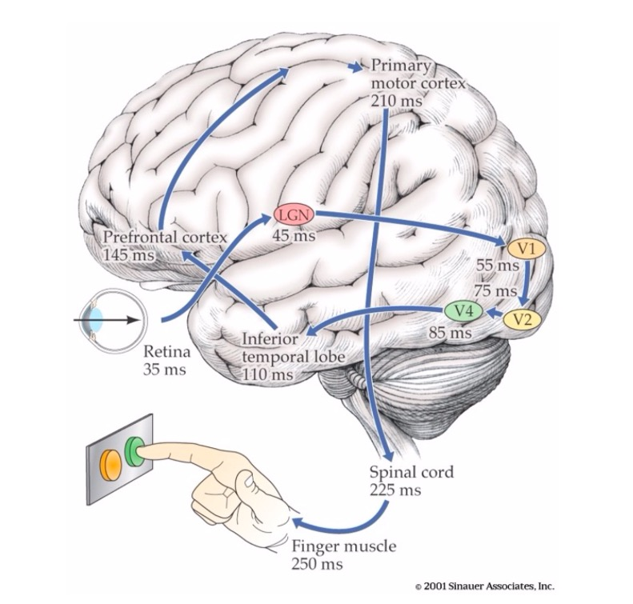
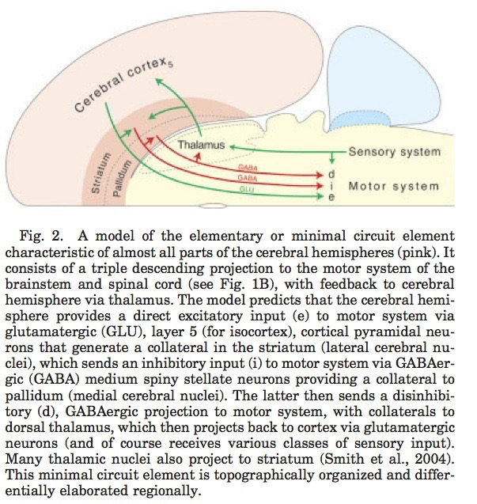
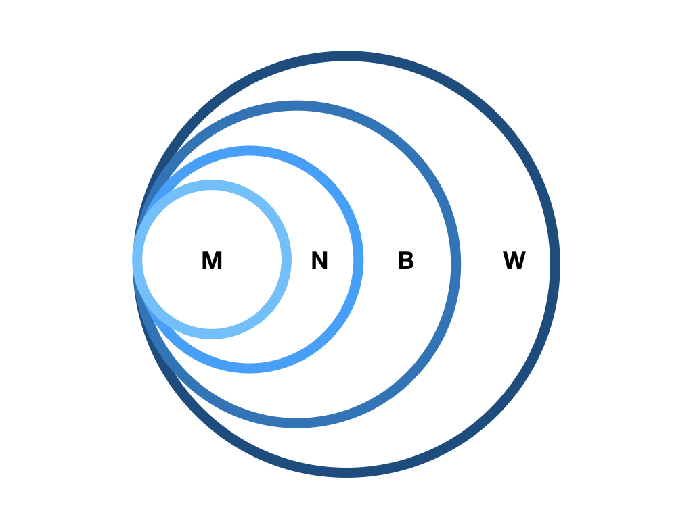
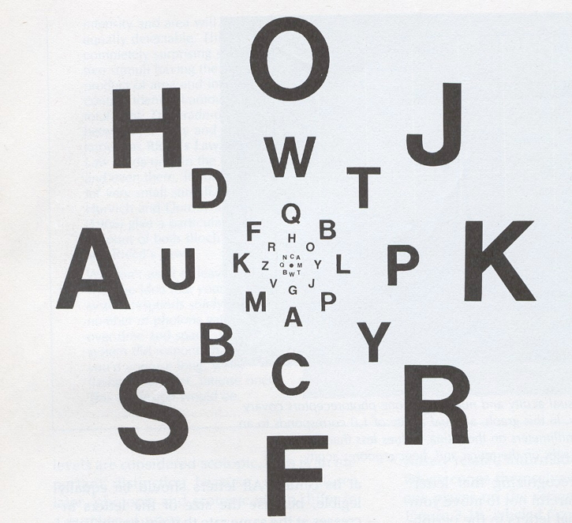

# Fun

<iframe width="560" height="315" src="https://www.youtube.com/embed/MrHxhQPOO2c" frameborder="0" allow="accelerometer; autoplay; encrypted-media; gyroscope; picture-in-picture" allowfullscreen></iframe>

<!-- See me, feel me, touch me, hear me from Tommy -->

<iframe width="560" height="315" src="https://www.youtube.com/embed/VpGHXPoJXk8" frameborder="0" allow="accelerometer; autoplay; encrypted-media; gyroscope; picture-in-picture" allowfullscreen></iframe>

# Principles of sensation & perception

## Senses as (perception/action) systems

Source: Amazon

Source: Swanson

Source: Swanson, 2005

### Smartphone as metaphor

- Accelerometer
- Gyroscope
- Magnetometer
- Proximity sensor
- Ambient light sensor
- Barometer
- Thermometer
- Mic
- Camera
- Radios (Bluetooth, wifi, cellular, GPS)

<http://www.phonearena.com/news/Did-you-know-how-many-different-kinds-of-sensors-go-inside-a-smartphone_id57885>

## Perception/action system dimensions

- Interoceptive
  - Body position, movement, posture
  - Internal status: hunger, thirst, arousal, discomfort/pain, etc.
- Exteroceptive
  - Layout of environment, contents

### Questions for interoception

- Tired or rested?
- Well or ill?
- Hungry or thirsty or sated?
- Stressed vs. coping?
- Emotional state?

### Questions for exteroception

- Who/What is out there?
- Animate/inanimate?
    - Conspecific (same species)/non?
    - Threat/non?
    - Familiar/un?
    - Mate/non? or Friend/not?
    - Food source/non
- Where is it?
    - Distance
      - Proximal
      - Distal
    - Elevation, azimuth
    - Coordinate frames
      + Self/ego (left of me)
      + Object (top of object)
      + Allo/world (North of College)
- Where moving?

### Questions for action

- What kind of response?
    + External
      - Move body
        - Approach/avoid/freeze
        - Signal/remain silent
        - Manipulate
    + Internal
        - Change physiological state
- Speed, quality, direction of response

## From world to brain

| Realm               | Domain               |
|---------------------|----------------------|
| $W$                 | The world            |
| $B$                 | The body             |
| $N$                 | The nervous system   |
| $M$                 | The mind             |

### Properties of the world

- Behaviorally relevant conditions, events, and entities...
- Generate patterns...
    - Chemical
    - Photic/electromagnetic
    - Mechanical/acoustic
- That specialized sensors detect
- Neural circuitry processes

### More than 5 sensory channels

- What is the energy/chemical channel?
- Different energy/chemical channels carry different types of information
    + What is out there
    + Where it's located
- Different energy/chemical channels convey information at different rates
- Information about behaviorally relevant dimensions often signaled by multiple sources

### Vision

- Source: Electromagnetic radiation
    - Reflected from surfaces
- What is it?
    - Shape, size, surface properties (color, texture, reflectance, etc.)
    - Wavelength/frequency, intensity
- Where is it?
    - Position: Left/right; up/down on retina
    - Near/far: retinal disparity, interposition, height above horizon...
    - Orientation, motion

### Audition

- Source: Mechanical vibrations in air or water
- What is it?
    - Pattern of frequencies, amplitudes, durations
- Where is it?
    - Left/right or up/down: Interaural time/phase, intensity differences, pinnae filtering
    - Motion: Frequency shifts via Doppler effect
    
### Chemosensation

- Source: Chemicals in mouth, nasal cavity 
- What is it?
    - Mixtures of chemicals
- Where is it?
    - Left/right; up/down; near/far via intensity gradients
    
### Somatosensation

- Source: Thermal or mechanical stimulation (vibration/pressure) of skin
- What is it?
    - Shape, size, smoothness, mass, temperature, deformability: Pattern of stimulation
- Where it it?
    - Pattern of cutaneous receptors on skin
    
### Interoception

- Hunger/thirst
    - Receptors for nutrient, fluid levels
- Energy levels
    - Receptors for hormones, NTs 
    - ANS responses
- Temperature
    - Receptors in skin, viscera
- Mating interest
    - Receptors for hormones, NTs 
    - ANS responses
- Body position & movement (proprioception)
    - Receptors in muscles, joints, skin

## Features of sensory signals

### Change across time

- Tonic (sustained) vs. phasic (transient) responses 
- Adaptation
    + Decline in sensitivity with sustained stimulation 
    + Most sensory systems attuned to change

- Information propagates at different speeds
    - Bigger diameter: Faster
    - Denser myelin: Faster

<iframe width="800px" height="800px" src="https://en.wikipedia.org/wiki/Nerve_conduction_velocity">
</iframe>
    
### Detect repeating signals
  
+ In space (textures)
+ In time
    
#### Vision: Spatial frequency/contrast sensitivity

[[@Roark2019-fx]](http://dx.doi.org/10.1002/mnfr.201801053)

#### Audition: Frequencies in sound

### Compare (>1) sensors located in different parts of the body
    
+ Eyes
+ Ears
+ Skin surface
+ Nostrils
- Tongue

### ["Receptive fields"](https://en.wikipedia.org/wiki/Receptive_field)

+ Area on sensory surface (e.g., retina, skin) that when stimulated changes neuron's firing
    
#### Tactile

#### Visual

https://brainconnection.brainhq.com/2004/03/06/overview-of-receptive-fields/

https://foundationsofvision.stanford.edu/chapter-6-the-cortical-representation/

### Topographic maps

#### Auditory: Tonotopic maps

#### Visual: Retinotopic maps

[[@dougherty_visual_2003]](https://doi.org/10.1167/3.10.1)

#### Somatosensory: Somatotopic maps in S1 & M1

### Sensivity non-uniform

#### Two-point touch thresholds

#### Somatosensory homunculus

#### Visual acuity non-uniform

https://upload.wikimedia.org/wikipedia/commons/thumb/2/27/AcuityHumanEye.svg/270px-AcuityHumanEye.svg.png

#### Hearing thresholds non-uniform

http://auditoryneuroscience.com/

### Processing hierarchical/sequential AND parallel

# Case study: Vision

## Properties of Electromagnetic (EM) radiation

http://en.wikipedia.org/wiki/File:EM_Spectrum_Properties_edit.svg

- Wavelength/frequency
- Intensity
- Location/position of source
- Reflects off some materials
- Refracted (bent) moving through other materials
- Information across space (and time)

http://apod.nasa.gov/apod/ap140605.html

### Reflectance spectra differ by surface

http://http://www.vgt.vito.be/userguide/book_1/4/42/ie42bd.gif

### [Optic array](https://en.wikipedia.org/wiki/Ambient_optic_array) specifies geometry of environment

### Categories of wavelength specify perception of color

- Eyes categorize wavelength into relative intensities within wavelength bands
- RGB ~ **R**ed, **G**reen, **B**lue
    + Long, medium, short wavelengths
- *Color is a neural/psychological construct*

<!-- ## How a camera works -->

<!-- 
 -->
<!--  -->
<!-- 
 -->

## The biological camera

### Parts of the eye

- *Cornea* - refraction (2/3 of total)
- *Pupil* - light intensity; diameter regulated by Iris.
- *Lens* - refraction (remaining 1/3; focus)
- *Retina* - light detection
    + ~ skin or organ of Corti in inner ear
- *Pigment epithelium* - regenerate photopigment
- *Muscles* - move eye, reshape lens, change pupil diameter

### Geometry of retinal image

- Image inverted (up/down)
- Image reversed (left/right)
- Point-to-point map (*retinotopic*)
- Binocular and monocular zones

### The *fovea*

http://www.brainhq.com/sites/default/files/fovea.jpg

- Central 1-2 deg of visual field
- Aligned with visual axis
- *Retinal ganglion cells* pushed aside
- Highest *acuity* vision == best for details
- Acuity varies from center to periphery

http://michaeldmann.net/pix_7/blndspot.gif

#### What part of the skin is like the fovea?

### *Photoreceptors* in retina detect light

- *Rods*
    + ~120 M/eye
    + Mostly in periphery
    + Active in low light conditions
    + One wavelength range
- *Cones*
    + ~5 M/eye
    + Mostly in center
    + 3 wavelength ranges
    

https://foundationsofvision.stanford.edu/

    

http://cnx.org/content/col11496/1.6/

#### Photoreceptor physiology

- Outer segment
    + Membrane disks
    + *Photopigments*
        - Sense light, trigger chemical cascade
- Inner segment
    + Synaptic terminal
- Light *hyperpolarizes* photoreceptor!
    + The *dark current*
    
## Retina

- Physiologically *backwards*
    + How?
- Anatomically *inside-out*
    + How?
  
### Retina

- Physiologically *backwards*
    + Dark current
- Anatomically *inside-out*
    + Photoreceptors at back of eye

http://www.retinareference.com/anatomy/

- Information flows...
  - From photoreceptors...
  - To *Bipolar cells*
    + <-> and *Horizontal cells*
  - To *Retinal ganglion cells*
    + <-> and *Amacrine cells*
  - To cerebral cortex

#### *Center-surround receptive fields*

- Center region
    + Excites (or inhibits)
- Surround region
    + Does the opposite
- Bipolar cells & Retinal Ganglion cells ->
- Most activated by "donuts" of light/dark
    + Local contrast (light/dark differences)

### *Opponent processing*

http://www.visualexpert.com/sbfaqimages/RGBOpponent.gif

- Black vs. white (achromatic)
- Long (red) vs. Medium (green) wavelength cones
- (Long + Medium) vs. Short cones
- Can't really see reddish-green or bluish-yellow
    - "Oppose" one another at cellular/circuit level

## From eye to brain

- Retinal ganglion cells
- 2nd/II cranial (optic) nerve
    + Optic chiasm ($\chi$ - asm): Partial crossing of fibers
    + Nasal hemiretina (lateral/peripheral visual field) cross
    + Left visual field (from L & R retinae) -> right hemisphere & vice versa
- *Lateral Geniculate Nucleus (LGN)* of thalamus (receives 90% of retinal projections)
- Hypothalamus
    + *Suprachiasmatic nucleus* (superior to the optic chiasm): Synchronizes day/night cycle with circadian rhythms
- Superior colliculus & brainstem

### LGN

- 6 layers + intralaminar zone
    + Parvocellular (small cells): chromatic
    + Magnocellular (big cells): achromatic
    + Koniocellular (chromatic - short wavelength?)
- Retinotopic map of opposite visual field

### From LGN to V1

- Via *optic radiations*
- *[Primary visual cortex (V1)](http://www.scholarpedia.org/article/Area_V1)* in occipital lobe
- Create "stria of Gennari" (visible stripe in layer 4)
- Calcarine fissure (medial occiptal lobe) divides lower/upper visual field

### Human V1

[[@dougherty_visual_2003]](http://dx.doi.org/10.1167/3.10.1)

- Fovea overrepresented
    + Analogous to somatosensation
    + High acuity in fovea vs. lower outside it
- Upper visual field/lower (ventral) V1 and *vice versa*

#### Laminar, columnar organization

- 6 laminae (layers)
    + Input: Layer 4 (remember stria of Gennari?)
    + Output: Layers 2-3 (to cortex), 5 (to brainstem), 6 (to LGN)
- Columns
    + Orientation/angle
    + Spatial frequency
    + Color/wavelength
    + Eye of origin, *ocular dominance*

<iframe width="560" height="315" src="https://www.youtube.com/embed/IOHayh06LJ4" frameborder="0" allowfullscreen></iframe>

https://foundationsofvision.stanford.edu/wp-content/uploads/2012/02/dir.selective.png

#### From center-surround receptive fields to line detection

[[@panichello_predictive_2013]](http://dx.doi.org/10.3389/fpsyg.2012.00620)

### Ocular dominance columns

http://www.scholarpedia.org/w/images/9/99/11-Hubel-Wiesel-model.png

<iframe width="560" height="315" src="https://www.youtube.com/embed/KjAQdc29vF8" frameborder="0" allowfullscreen></iframe>

### Beyond V1

- Larger, more complex receptive fields
- *Dorsal stream* (where/how)
    + Toward parietal lobe
- *Ventral stream* (what)

## What is vision for?

- What is it? (form perception)
- Where is it? (space perception)
- How do I get from here to there (action control)
- What time (or time of year) is it?

# References
